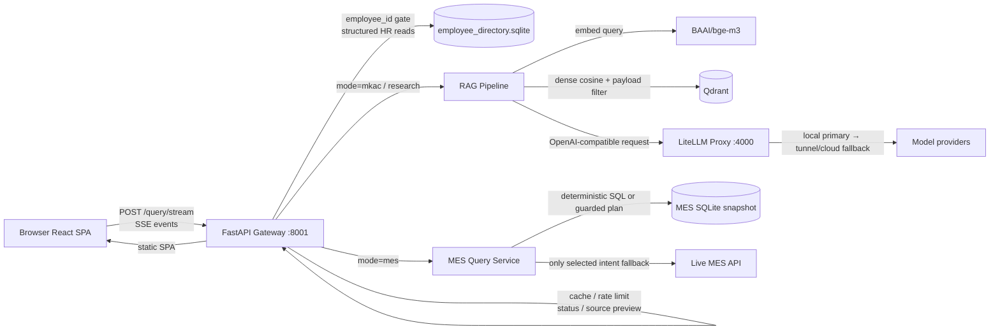
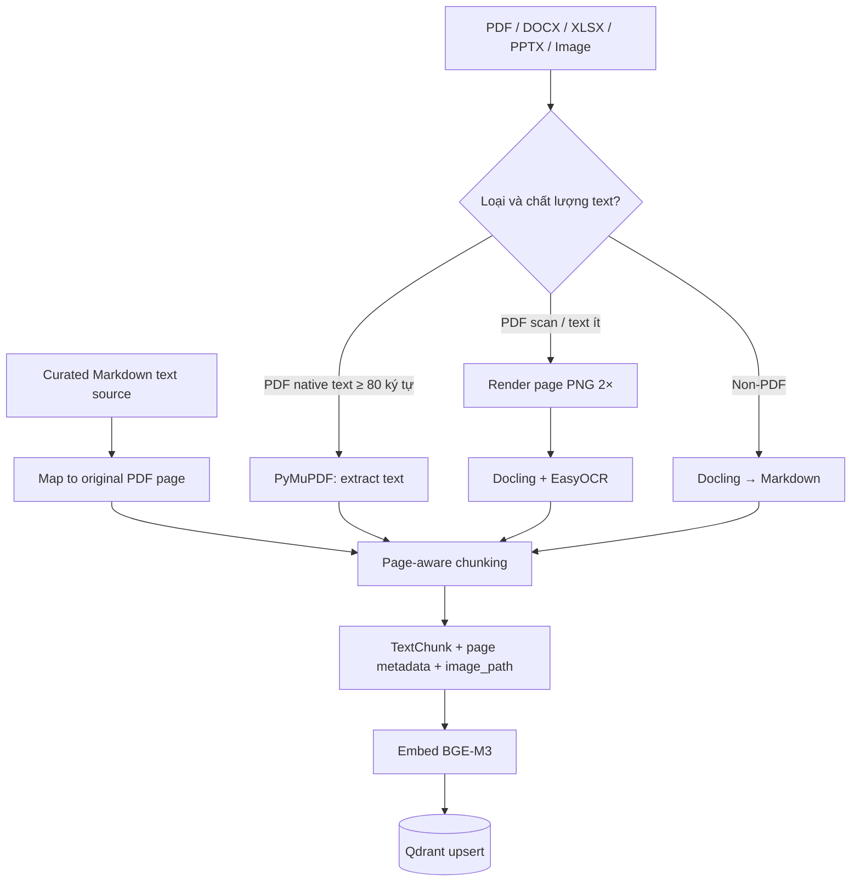
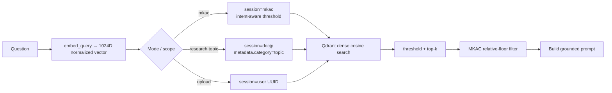
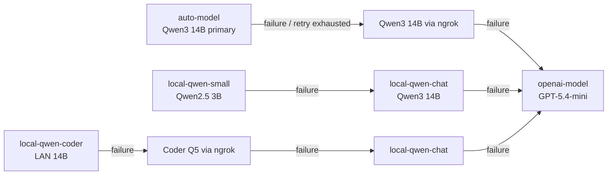
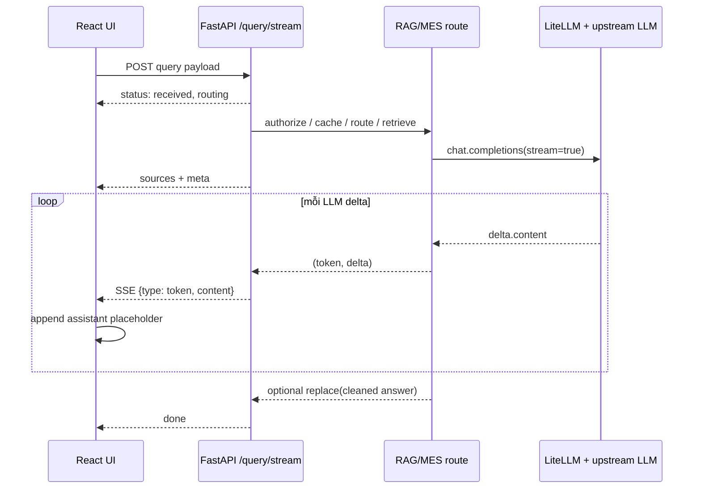
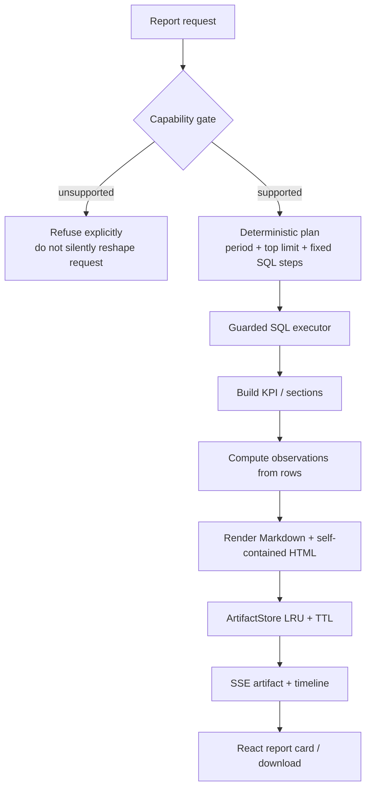
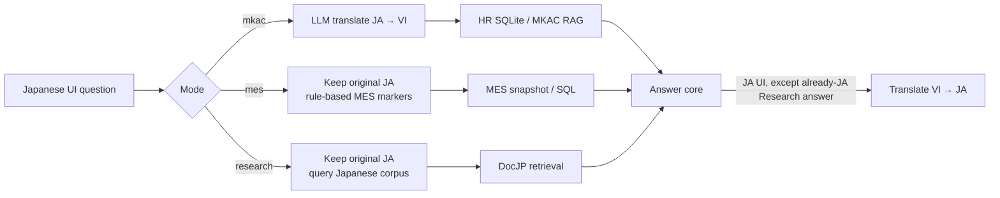

# Meibook: Technical Deep-Dive cho AI Engineer Interview

> **Mục tiêu học tập:** giải thích Meibook như một production AI system: tách deterministic data path khỏi generative path, có retrieval provenance, streaming UX, model routing và guardrail vận hành. Tài liệu này mô tả implementation trong checkout Production `VLLM-PD`; cấu hình runtime có thể thay đổi theo environment.

---

## 1. System Architecture Overview

### 1.1 Bài toán và nguyên tắc kiến trúc

Meibook là internal AI assistant cho ba workload có mức độ rủi ro khác nhau:

| Mode | Nguồn sự thật | Đặc điểm rủi ro | Chiến lược chính |
|---|---|---|---|
| `mkac` | tài liệu nội bộ + employee SQLite | policy/HR có thể hallucinate | RAG grounded, structured Q&A ưu tiên SQLite |
| `mes` | MES snapshot SQLite, một số live API | số liệu sản xuất cần kiểm chứng | deterministic query trước; guarded Text-to-SQL chỉ là fallback |
| `research` | Qdrant `docjp_knowledge` theo topic | câu hỏi sâu trên corpus Nhật | retrieval có category filter, trả nguồn/preview |

**Thesis phỏng vấn:** đây không phải chatbot “một prompt gọi LLM”. Đây là *routing system* điều phối nhiều execution path. Khi câu hỏi có thể trả lời bằng dữ liệu có cấu trúc, hệ thống cố tình không dùng RAG/LLM để tránh biến sự thật thành xác suất.

### 1.2 Luồng component và ranh giới trust

**Điểm cần nói khi interview**

- FastAPI là *policy enforcement point*: auth gate, mode routing, cache, rate limit, translation, SSE protocol và source preview đều ở đây.
- Qdrant/LiteLLM chỉ bind loopback trong Compose; cổng ứng dụng `8001` mới được publish. Đây là network segmentation tối thiểu, tránh biến vector DB/model proxy thành public API.
- Mọi request model dùng OpenAI-compatible client nhưng endpoint thực tế là LiteLLM. Điều này giảm coupling với provider và làm fallback minh bạch với business layer.
- Runtime singleton được tạo trong FastAPI lifespan: `VectorStore` cho `docmind_documents`, `mkac_knowledge`, `docjp_knowledge`; `Embedder`; `DocumentParser`; `RAGPipeline`; MES services và report agent.

### 1.3 Deployment topology

Docker Compose có ba service chính:

- **`app`**: FastAPI + static `frontend/dist`; mount source read-only, dữ liệu/index/preview là bind mount riêng.
- **`qdrant`**: persistent storage `./qdrant_storage`; exposed `127.0.0.1:6333`.
- **`litellm`**: model gateway; exposed `127.0.0.1:4000`, nhận YAML và secrets qua runtime env.

Thiết kế bind mount làm rõ lifecycle: code/config có thể deploy khác với data, vector index, upload, log và credential. Đây là điểm quan trọng để tránh vô tình copy Dev runtime data sang Production.

---

## 2. RAG Pipeline Deep-Dive

### 2.1 Ingestion: document thành evidence có thể truy vết

#### Parse strategy: vì sao dùng hai engine?

- **PyMuPDF là đường fast path cho PDF**: đọc native text theo trang và render trang cho citation preview. Nó nhanh hơn OCR và giữ được cấu trúc trang.
- **Docling/EasyOCR là fallback có điều kiện**, chỉ chạy khi native text dưới `MIN_NATIVE_PAGE_CHARS = 80`. Quyết định này tiết kiệm GPU/CPU, giảm latency ingestion và tránh OCR làm hỏng PDF đã có text tốt.
- **Curated text source** là human-in-the-loop quality control. Markdown do người biên soạn thay thế OCR kém, nhưng `image_path` vẫn trỏ trang PDF gốc. Nhờ vậy answer chất lượng cao vẫn có evidence visual để audit.

Có guardrail ingestion rõ ràng: `MAX_DOCUMENT_PAGES` mặc định 100, deadline processing 300 giây, OCR failure được log và không làm crash toàn bộ pipeline, file tạm bị cleanup.

#### Chunking: tối ưu semantic continuity thay vì cắt theo token mù quáng

| Tình huống | Chiến lược | Lý do |
|---|---|---|
| Text thông thường | 1.400 ký tự/chunk, overlap 220, loại chunk <20 ký tự | giữ semantic continuity giữa boundaries; giới hạn prompt/context |
| Dòng quá dài | hard-split | chống sheet dump/minified export làm chunk bất thường |
| Markdown table ≥12 data rows | chunk theo hàng, 15 rows/chunk hoặc budget 3.600 chars | không cắt giữa một row và giữ row-level retrievability |
| Excel table nhiều ô rỗng | compact sparse row, giữ header label | tránh vector bị nhiễu bởi `| | |`; vẫn bảo toàn nghĩa cột |

Với bảng lớn, header và separator được lặp lại trong mỗi chunk. Đây là một design choice đáng nói: embedding của một row chỉ hữu ích nếu model còn biết giá trị đó thuộc cột nào. Preamble tối đa 600 ký tự chỉ gắn vào chunk đầu để không nhân bản quá nhiều token.

#### Metadata contract

`TextChunk` mang: `text`, `source_file`, `page_number` (1-index), `chunk_index`, `content_type`, `metadata`.

Metadata còn có provenance theo từng trang: `source` (`pymupdf`, `docling-ocr`, `curated-md`), `ocr_method`, `ocr_chars`, `image_path`; caller bổ sung `category`, `title`, `collection`, `effective_date`.

**Why it matters:** metadata không chỉ để hiển thị. Nó là data contract nối parser → Qdrant filter → API source → preview modal. Nếu bỏ `page_number` hoặc `image_path`, answer vẫn có thể đúng nhưng mất auditability, một failure mode thường bị bỏ qua trong demo RAG.

### 2.2 Embedding layer

| Thuộc tính | Implementation | Ý nghĩa vận hành |
|---|---|---|
| Model | `BAAI/bge-m3` | multilingual dense embedding, hợp VI/JA |
| Dimension | 1024 | phải khớp `VectorParams(size=1024)` của Qdrant |
| Normalization | `normalize_embeddings=True`, L2 unit vector | cosine similarity tương đương dot product trên normalized vector |
| Output contract | luôn cast `float32` | downstream Qdrant/Numpy nhất quán dù inference dùng low precision |
| Batch default | 8, override được qua env/per call | cần tune theo VRAM và độ dài chunk |
| Inference | `torch.inference_mode()` | tắt gradient để giảm memory/overhead |

Device chọn theo thứ tự: constructor argument → `EMBEDDING_DEVICE` → CUDA availability. CUDA bị cấu hình nhưng runtime không có sẽ fallback CPU; `float16` trên CPU tự đổi sang `float32`. Whitelist dtype chỉ gồm `float16`, `bfloat16`, `float32`.

Một `threading.Lock` serializes `SentenceTransformer.encode()`. Đây là deliberate throughput trade-off: khi share một PyTorch/CUDA model, hai encode đồng thời có thể không thread-safe hoặc tạo VRAM spike/OOM. Production system thường ưu tiên predictable latency và availability hơn benchmark throughput đẹp.

**Potential improvement:** BGE-M3 query instruction prefix đang để rỗng. Cần A/B evaluation theo corpus VI/JA trước khi bật prefix, vì prefix có thể nâng quality retrieval nhưng cũng gây embedding distribution shift nếu document/query strategy thay đổi không đồng bộ.

### 2.3 Vector store và retrieval

Qdrant có ba collection logical:

| Collection | Scope | Isolation/filter |
|---|---|---|
| `docmind_documents` | user upload/legacy research | mandatory `session_id` payload |
| `mkac_knowledge` | shared internal corpora | session cố định `mkac` |
| `docjp_knowledge` | Research document corpus | session `docjp` + `metadata.category` topic |

Vector config là **dense cosine only**. Hiện không có BM25/sparse/hybrid retrieval ở `VectorStore`. Collection tạo payload index `session_id`, `source_file`, `metadata.category`; filter dùng `must`, tức không thể search chéo session/category chỉ vì query embedding gần nhau.

Các default đáng nhớ:

- generic vector store `top_k=5`, `score_threshold=0.3`;
- RAG pipeline base threshold `0.25`;
- MKAC runtime threshold mặc định `0.38`, company profile `0.42`, employee statistics có thể hạ `0.34`;
- Research: top-k bounded, Compose đặt `RESEARCH_TOP_K=6`, threshold `0.35`.

Ngưỡng không phải universal truth. Multilingual corpus thường có cosine thấp hơn monolingual; threshold được tuned theo mode/risk. Nếu không có chunk MKAC đạt mức đủ tốt, pipeline có thể đi web fallback hoặc trả general fail-closed response, thay vì “lấp chỗ trống” bằng general knowledge.

**Reranking trong implementation hiện tại:** không có cross-encoder reranker riêng. “Reranking” thực tế là post-retrieval policy: score threshold, intent/category preference và `_filter_relative_results` giữ result có score ≥ 85% result tốt nhất. Đây là điểm cần trả lời chính xác: không nên gọi nó là neural reranking.

### 2.4 Prompt construction và answer generation

`build_rag_prompt()` dựng sequence:

1. system prompt theo `mkac`, `research`, `web` hoặc general;
2. tối đa 6 turns lịch sử, mỗi turn giới hạn 1.500 ký tự;
3. user context đã xác thực (nếu HR);
4. retrieved chunks có filename/page; từng chunk bị cap `RAG_MAX_CHUNK_CHARS_IN_PROMPT` mặc định 4.000;
5. tối đa hai page image được base64 thành `image_url` khi câu hỏi cần vision;
6. question + instruction hành vi.

System prompts nói rõ: chỉ dùng evidence, không biến knowledge chung/web thành internal policy, không tự ghi citation vì UI render source riêng, và phải nói thiếu thông tin khi evidence không đủ.

**Prompt injection defense:** web results được coi là untrusted data và prompt nêu rõ bỏ qua chỉ dẫn thực thi nằm trong web content. Safety guard cấp API chặn một số prompt injection/cross-system command rõ ràng trước retrieval/model. Đây là defense-in-depth, không phải lý do để tin rằng keyword filter đủ chống mọi prompt injection.

**Answer budget theo nhiệm vụ:** MKAC general 256 tokens, simple 512, extended/vision 768; research 640 hoặc extended bounded tới 2.048. Việc phân biệt budget giúp local model ít lan man, giới hạn cost/latency và làm UX dễ dự đoán hơn.

### 2.5 Provenance tới UI

`format_sources()` trả `file`, `page`, `score`, `type`, preview snippet, title/category/effective date, URL và `has_page_preview`. `/sources/preview` validate filename, page, selected store/session, allowed roots, extension trước `FileResponse`.

Điểm phỏng vấn: citation không chỉ là “hiển thị link”; đây là một authorization/path-validation flow. Server re-resolves stored path và kiểm tra nó nằm trong upload/MKAC/DocJP processed roots để tránh arbitrary file read.

---

## 3. LLM Integration Patterns

### 3.1 LiteLLM như model control plane

Business code gọi logical aliases, không hard-code provider URL. LiteLLM làm adapter/routing layer cho Ollama native, OpenAI-compatible local endpoint và cloud fallback.

| Alias | Physical model/provider | Nhiệm vụ |
|---|---|---|
| `auto-model`, `local-qwen-chat` | `ollama_chat/qwen3:14b` | default conversational RAG |
| `local-qwen-small` | `ollama_chat/qwen2.5:3b-instruct` | translation, intent, rewrite, format ngắn |
| `local-qwen-coder`, `coding-model` | `openai/qwen2.5-coder:14b` qua LAN | SQL planning/coding-oriented tasks |
| `local-qwen-*-ngrok` | same task class qua tunnel / llama.cpp | local connectivity fallback |
| `openai-model` | `openai/gpt-5.4-mini` | cloud fallback cuối |
| `grok-model` | OpenAI-compatible Grok endpoint | vision/legacy route |

### 3.2 Fallback chains: availability theo role, không chỉ theo vendor

Lý do thiết kế theo role:

- model 3B xử lý auxiliary tasks nhanh/rẻ; fallback lên chat model nếu small model unavailable;
- coder model được ưu tiên khi task đòi hỏi structured JSON/SQL planning;
- fallback local/tunnel trước cloud để giảm egress, cost và exposure dữ liệu;
- cloud independent fallback cải thiện resilience khi local infrastructure gặp sự cố đồng thời.

Qwen3 dùng adapter `ollama_chat` với Ollama root endpoint, không dùng direct OpenAI-compatible `/v1`, vì endpoint đó từng có nguy cơ reasoning output nhưng `message.content` rỗng. Backend còn gửi `extra_body={think:false, num_ctx:...}` cho local aliases và cleanup `<think>`/repetitive loop sau generation.

### 3.3 Timeout, retry, concurrency và cost

- Router timeout 120 giây; `auto-model` timeout 12 giây để fail fast; small model 30 giây; chat/coder/cloud thường 120 giây.
- `num_retries=1`; global upstream concurrency = 8.
- Deployment concurrency: chat/coder thường 1; small models 2. Điều này là backpressure, **không phải per-user rate limit**.
- Local routes khai báo token cost 0 và token limits; cloud config hiện chưa có cost tracking/budget enforcement đầy đủ. Trong production lớn hơn, cần spend logging, tenant budget, alert và circuit breaker cho cloud fallback.

**Interview trade-off:** LiteLLM giảm vendor lock-in nhưng adds one hop và một failure domain. Vì vậy proxy cần `/health`, version pinning, per-route timeout và observability; không nên coi nó là “free abstraction”.

---

## 4. Streaming & Real-time

Frontend không dùng `EventSource` vì cần **POST body** chứa question, mode, employee ID, language, session và conversation context. Thay vào đó, React dùng `fetch`, `response.body.getReader()`, `TextDecoder`, buffer theo `\n\n`, parse `data: <JSON>`.

### Event contract

| Event | UI behavior |
|---|---|
| `status` | hiển thị trạng thái localized: routing, rag, mes, translation, finalizing |
| `sources` | gắn citations/source panel trước text answer |
| `meta` | model, mode, answer scope, cache/research scope |
| `token` | append incremental text vào assistant placeholder |
| `replace` | thay toàn bộ answer sau cleanup output local model |
| `agent_plan`, `tool_start`, `tool_result`, `agent_done` | timeline Report Agent |
| `artifact` | render report card và download link |
| `error` | đưa vào error flow UI |

Response có `Cache-Control: no-cache` và `X-Accel-Buffering: no` để proxy không buffer chunk, nếu không streaming “đúng code” nhưng người dùng vẫn chỉ thấy full answer cuối cùng.

### UX/performance choices

- `AbortController` cho phép Stop request đang stream.
- UI tạo user message + assistant placeholder ngay, giảm perceived latency.
- `ReactMarkdown` của message cũ được `memo`; nếu không, mỗi token gây reparse toàn bộ history, biến stream dài thành O(n²)-like UI cost.
- Backend chỉ `replace` nếu cleanup khác content đã phát. Nhờ vậy normal path là streaming thật; fallback cleanup không làm user thấy reasoning leak.
- Với Japanese UI ở non-Research, backend hiện thường chờ answer tiếng Việt rồi dịch toàn câu sang Nhật, nên có trade-off: correctness/localization tốt hơn nhưng không token-stream được qua translation leg.

---

## 5. Multi-Agent Architecture: Pattern báo cáo “4 vai trò”

### 5.1 Làm rõ implementation thực tế

Report Agent hiện **không phải bốn autonomous LLM agents**. Gọi nó là “4-agent” dễ gây hiểu sai. Implementation đáng tin cậy hơn là một *deterministic multi-stage report pattern* với bốn vai trò tách trách nhiệm:

1. **Capability Gate** — nhận diện report và fail-closed nếu semantics ngoài template.
2. **Planner** — `build_report_plan()` tạo SQL steps cố định từ period/shape đã parse; không LLM-generated SQL.
3. **Guarded Executor** — chạy từng step qua `MesSqlAgent.execute`: AST validation, allowlisted views, read-only SQLite, timeout, row cap.
4. **Renderer & Artifact Coordinator** — tính observations bằng code, render Markdown/HTML, lưu artifact và phát SSE timeline.

### 5.2 Coordination protocol

`MesReportAgent.run()` là async generator:

- emits `plan` gồm title/period/steps;
- với mỗi step emits `step_start`, sau đó `step_result` (`done`, `empty`, `error`);
- cuối cùng emits `report` với report payload và concise summary.

API map chúng sang SSE `agent_plan`, `tool_start`, `tool_result`, `artifact`, `agent_done`. Người dùng thấy data operation đang diễn ra nhưng không thấy chain-of-thought; timeline chỉ là observable execution progress.

### 5.3 Vì sao không dùng LLM để viết observations?

`_observations()` tính tỷ trọng top Lot/top error và peak time trực tiếp từ result rows. Điều này giữ report reproducible: cùng snapshot + cùng question → cùng số liệu, không có nguy cơ LLM đổi số hoặc thêm causal claim. Đây là nguyên tắc quan trọng: **LLM có thể giải thích dữ liệu, nhưng không nên là source of truth cho KPI**.

### 5.4 Artifact store và giới hạn

`ArtifactStore` là `OrderedDict` in-memory, async lock, LRU max 200, TTL 6 giờ bằng monotonic clock. `/reports/{uuid}` trả HTML attachment với `nosniff`.

Điểm cần nêu khi interview:

- phù hợp demo/single process, không phù hợp persistence/audit/multi-worker;
- restart làm mất artifact; worker khác có thể không thấy artifact;
- HTML renderer escape values, nhưng store không tự sanitize arbitrary HTML;
- roadmap thực tế: SQLite/object storage + ownership authorization + signed/download-scoped URL + audit record.

---

## 6. Data Governance & Anti-Hallucination

### 6.1 Deterministic first: lựa chọn theo mức độ hậu quả

| Câu hỏi | Execution path | Vì sao |
|---|---|---|
| HR headcount/department/profile | parameterized SQLite `SELECT` | canonical structured fact; không cần probabilistic generation |
| MES known intent/time query | regex/rule + template SQL | reproducible, testable, no SQL hallucination |
| MES complex but schema-supported | guarded LLM planner → validated SQL | mở rộng coverage nhưng có boundary kỹ thuật |
| Internal policy/document QA | RAG grounded in source chunks | evidence là text unstructured |
| No sufficient evidence | web scope hoặc fail-closed response | không biến knowledge chung thành policy nội bộ |

### 6.2 Guarded Text-to-SQL contract

MES SQL Agent nhận semantic model JSON, không raw schema tùy ý. SQL validation có nhiều lớp:

1. chỉ đúng **một** statement;
2. phải là `SELECT` hoặc `WITH ... SELECT`;
3. AST qua `sqlglot`; cấm DDL/DML/PRAGMA/ATTACH/transaction;
4. chỉ `ALLOWED_VIEWS`, cấm catalog/schema ngoài;
5. function allowlist;
6. auto append limit nếu thiếu; runtime rows capped (config 100, maximum bounded);
7. SQLite URI `mode=ro`, `PRAGMA query_only=ON`, authorizer;
8. progress handler timeout (Compose 2 giây);
9. `EXPLAIN QUERY PLAN` trước execution;
10. answer validator kiểm tra model answer có required terms/số liệu, nếu fail dùng deterministic fallback answer.

Điểm tinh tế: `read-only` một mình không đủ. A `SELECT` vẫn có thể expensive, query table không được phép hoặc expose schema/data ngoài semantic contract. Vì vậy SQL AST, view allowlist, row cap, timeout và connection authorizer bổ sung lẫn nhau.

### 6.3 HR data governance

HR structured Q&A dùng parameter binding, read-only behavior ở code; output có source rỗng vì facts đi trực tiếp từ SQLite. Cache key có employee ID; context-dependent pronoun question không cache để tránh response của A bị dùng cho B.

Tuy vậy authentication hiện là **employee-ID access gate**, không phải strong auth: không password/SSO/session-signed identity; guest `000000` tồn tại; CORS rộng. Hệ thống còn có PII risk: structured answer có thể trả birth date/marital status; RAG user context có thể được đưa upstream model.

Câu trả lời interview trưởng thành không chỉ liệt kê guardrails, mà phải nói rõ residual risk và roadmap: SSO/OIDC, signed session, RBAC/ABAC, field-level data minimization, provider data boundary, audit log và tenant-aware rate limit.

### 6.4 Provenance và anti-hallucination layers

- retrieval metadata: file/page/score/category/image path;
- prompt: only evidence, state insufficiency, no external-policy inference;
- deterministic fallback answers cho MES;
- no source output is not confused with no evidence: UI owns citations;
- source preview ties claim back to original rendered page;
- report limitations always declare snapshot, import time and truncation/errors;
- input safety guard blocks clear prompts targeting env/system files, destructive SQL or role bypass.

---

## 7. Cross-lingual NLP: Việt–Nhật

### 7.1 Routing translation theo domain

**Why mode-specific?** Translation is not neutral. Dịch sớm có thể làm méo Lot/product/error codes hoặc tạo retrieval noise với corpus Nhật. Vì vậy:

- `mkac`: UI Nhật → Việt vì HR rules/core RAG Việt-first; answer Việt → Nhật.
- `mes`: giữ original Japanese để deterministic marker (`ロット`, `品番`, `不良`, date/rank) hoạt động và technical codes không đổi.
- `research`: giữ Japanese vì `docjp_knowledge` là source Japanese; không double-translate answer đã có Japanese script.

### 7.2 Translation service contract

`TranslationService` dùng `local-qwen-small`, temperature `0.1`, LiteLLM OpenAI-compatible endpoint. Nó có glossary chuẩn hóa, bảo toàn Lot/product/error/employee IDs, email/URL/file/page/số liệu, Markdown và bullet list.

- Query/fragment cap 700 tokens.
- Answer: 1.000 tokens, Research 1.800.
- `think:false`; small model context mặc định 4.096, chat model 16.384.
- Nếu result rỗng/lỗi, fallback input gốc; bốn error messages có static VI→JA map không gọi LLM.
- Query chỉ dịch khi UI language chính xác `ja` **và có Japanese script**. Romaji/mã kỹ thuật không gọi LLM vô ích.

### 7.3 Rule-based intent detection

MES intent là predicates regex/normalization, không phải ML classifier: highest Lot error, compound error request, time-related question, date/date-range/month/top-limit extraction, và `should_use_sql_agent()`.

`normalized_text()` lowercase, replace `đ→d`, Unicode NFD bỏ diacritic, normalize punctuation/whitespace và sửa `nhiu→nhieu`. Đây là cách rất thực dụng để marker tiếng Việt/Anh ổn định.

Japanese không đi qua ASCII-normalized matcher; code kiểm tra original string bằng markers. Ưu điểm: no model latency, deterministic, dễ test. Nhược điểm: no Japanese tokenizer/grammar, marker một ký tự như `日`/`月` có thể over-trigger, một số intent Nhật (như error type) có coverage không hoàn toàn. Đây là ứng viên cho evaluation set và incremental grammar/entity extraction, không phải lý do tự động thay rule bằng LLM classifier.

---

## 8. Production Patterns

### 8.1 Reliability matrix

| Concern | Hiện có | Hạn chế / next step |
|---|---|---|
| Query rate limit | in-memory sliding window theo client IP | per-process; Redis/API gateway cho multi-worker |
| Upload protection | size limit, extension allowlist, page cap, semaphore + bounded queue | antivirus/content scanning, tenant quotas |
| Caching | LRU+TTL response cache; key scope mode/language/model/employee/research/snapshot | shared cache; explicit invalidation metrics |
| Cache correctness | disable cache cho context reference; MES key includes snapshot version | version all corpora/indexes as needed |
| Failure behavior | search returns empty fail-safe; writes/init fail-fast; model retry/fallback | circuit breaker, jitter/backoff, failure dashboards |
| Observability | `/metrics`: total, errors, cache hit, p50/p95, mode/scope; structured logs | Prometheus/OpenTelemetry traces/correlation IDs |
| Model backpressure | global LiteLLM concurrency 8; per deployment caps | queue/admission control per tenant, adaptive load shedding |
| Artifact lifecycle | in-memory LRU/TTL | persistent storage, ACL, audit trail |

### 8.2 Error handling philosophy

Không có một error policy duy nhất cho mọi subsystem:

- **vector search**: returns `[]` on exception để caller có thể fail closed/general or web fallback;
- **collection setup/upsert**: raises, vì silently missing writes sẽ corrupt knowledge base expectations;
- **OCR**: a page OCR failure may return empty and preserve pipeline availability; file/page limits are explicit errors;
- **MES SQL**: rejects unsafe/unsupported query rather than “best effort” execute;
- **report capability**: refuses unsupported semantics rather than silently converting to generic report;
- **model output**: validates required fields for MES; fallback to deterministic wording.

Đây là mature failure design: chọn fail-open/fail-closed theo semantic consequence, không theo convenience.

### 8.3 Caching and invalidation lesson

Cache không chỉ keyed by question. Meibook incorporates employee ID, mode, language, selected model, Research scope/topic and MES snapshot version. Context reference questions are excluded. This is important because caching personalized or time-versioned facts with only normalized question creates cross-user data leak and stale MES answer risks.

### 8.4 Deployment and operations checklist

1. Xác định đúng environment/branch/Compose file; Production dùng `docker-compose.web.yml`, port defaults 8001/4000/6333.
2. Sau UI change, build `frontend/dist`; source backend mounted read-only nhưng frontend is baked/mounted build output.
3. Check `/health`, `/metrics`, Qdrant collection status and LiteLLM model route.
4. Treat data import/index/migration as a separate change from code deploy; never reindex/clear collections without explicit authorization.
5. Secrets chỉ qua env/runtime mount; do not log employee/MES actual values or credentials.

---

## 9. Interview Q&A Cheat Sheet

### 1. Vì sao không dùng LLM cho mọi query?
**Trả lời:** LLM là generative, không phải database engine. Headcount HR và MES KPI cần reproducibility, exactness, auditing. Meibook route structured facts sang parameterized SQLite/deterministic SQL trước; LLM chỉ diễn đạt verified result hoặc xử lý unstructured evidence.

### 2. RAG pipeline end-to-end là gì?
**Trả lời:** Parse document → page-aware chunks + provenance → BGE-M3 embeddings → Qdrant upsert → embed query → filtered cosine retrieval → threshold/post-filter → grounded prompt → LiteLLM generation → sources/page preview returned to UI.

### 3. Tại sao page-aware chunking quan trọng hơn một text blob?
**Trả lời:** Vì citation cần answer traceable về trang tài liệu gốc. `page_number` và `image_path` giúp user kiểm tra evidence bằng visual preview; nó biến RAG từ “plausible answer” thành auditable answer.

### 4. Vì sao BGE-M3 output phải normalize L2?
**Trả lời:** Qdrant dùng cosine similarity. Unit normalization làm cosine comparable và cho phép dot product equivalence; all output được cast float32 để downstream contract ổn định dù GPU inference low precision.

### 5. Tại sao encode lock thay vì chạy song song để nhanh hơn?
**Trả lời:** Shared PyTorch/CUDA inference có thể unsafe và concurrent batches có thể OOM. Lock là trade-off ưu tiên predictable availability; muốn scale throughput thì deploy worker/model replicas có queue, không mở uncontrolled threads.

### 6. Chunk size/overlap giải quyết vấn đề gì?
**Trả lời:** Chunk 1.400 chars kiểm soát context và granularity retrieval; overlap 220 chars giữ câu/ý qua boundary. Với bảng lớn, row-wise chunk + repeated headers tránh cắt row và giữ column semantics.

### 7. Hệ thống có hybrid search/reranker không?
**Trả lời:** Hiện core `VectorStore` là dense cosine only; không có sparse BM25 hoặc cross-encoder reranker. Có post-retrieval threshold, category/intent filtering và relative score floor 85%. Khi interview phải phân biệt rõ heuristic filtering với neural reranking.

### 8. Vì sao threshold khác nhau theo mode?
**Trả lời:** Corpus/risk khác nhau. MKAC policy cần evidence mạnh nên threshold cao hơn; multilingual Research có thể cần threshold phù hợp distribution cross-lingual. Threshold phải tune bằng evaluation set, không lấy một số chung cho mọi corpus.

### 9. Prompt injection được xử lý thế nào?
**Trả lời:** Defense-in-depth: system prompt buộc answer chỉ dùng evidence, web results là untrusted data, API safety guard chặn một số request rõ ràng, SQL/action có separate policy boundaries. Keyword filter không đủ; high-impact actions vẫn cần allowlist và validation độc lập model.

### 10. LiteLLM mang lại lợi ích gì?
**Trả lời:** Logical alias tách business code khỏi provider API; routing/fallback/concurrency/timeouts tập trung; app vẫn dùng một OpenAI-compatible client. Đổi lại LiteLLM là failure domain bổ sung cần monitor/version pin/health check.

### 11. Khi nào dùng small/chat/coder model?
**Trả lời:** Small 3B cho translation/auxiliary tasks; chat 14B cho grounded conversational RAG; coder 14B cho structured SQL planning/coding. Chọn theo task capability, latency và reliability—not merely largest model.

### 12. Fallback chain thiết kế theo nguyên tắc nào?
**Trả lời:** Local primary → local alternate/tunnel → independent cloud. Nó tối ưu data locality/cost trước, nhưng vẫn giữ availability. Chains khác nhau theo role để không fallback coder task xuống model không hợp phù hợp quá sớm.

### 13. Vì sao Qwen3 dùng `ollama_chat` root endpoint?
**Trả lời:** Integration đã xác minh OpenAI-compatible `/v1` có thể trả reasoning nhưng empty content. Native adapter/root endpoint cùng `think:false` ổn định hơn; đây là ví dụ provider behavior ảnh hưởng architectural adapter choice.

### 14. Vì sao dùng POST SSE thay EventSource?
**Trả lời:** Query cần body phong phú và potentially sensitive context. Native EventSource chỉ GET; frontend dùng fetch readable stream, parse SSE frames thủ công, vẫn có incremental rendering và AbortController.

### 15. Event `replace` dùng khi nào?
**Trả lời:** Backend stream delta ngay để first-paint sớm, sau đó cleanup toàn answer để remove think/leak/repetition. Chỉ emit `replace` nếu cleaned answer khác emitted text, tránh reset UI ở normal path.

### 16. Tại sao sources được gửi trước tokens?
**Trả lời:** UI có thể render evidence/provenance ngay khi answer đang sinh. Nó tạo transparency và giúp user biết answer đang grounded, thay vì citations xuất hiện muộn như hậu xử lý trang trí.

### 17. “4-agent report pattern” thực tế là gì?
**Trả lời:** Không phải bốn autonomous LLM agents. Đó là bốn functional roles: capability gate, deterministic planner, guarded executor, renderer/artifact coordinator. Cách gọi chính xác tránh overclaim architecture.

### 18. Vì sao report planner không dùng LLM-generated SQL?
**Trả lời:** Report template là high-stakes numeric artifact. Fixed SQL plan có thể test/review/reproduce. LLM-generated SQL chỉ hợp fallback cho constrained ad hoc queries, và ngay cả đó phải AST-validate/read-only/limited.

### 19. SQL guardrails cụ thể gồm những gì?
**Trả lời:** One SELECT, sqlglot AST, forbidden nodes, view/function allowlist, auto LIMIT/row cap, read-only URI, SQLite authorizer, query-only pragma, progress-handler timeout, explain plan và deterministic fallback answer.

### 20. Tại sao read-only database vẫn chưa đủ an toàn?
**Trả lời:** Read-only không chặn expensive SELECT, access ngoài approved semantic layer hoặc function abuse. Safety phải cover write safety, data boundary, resource bound và semantic correctness.

### 21. Caching personalized AI answer có rủi ro gì?
**Trả lời:** Cache key chỉ có question có thể leak HR data across employee, stale MES result sau re-import, hoặc trả sai cho pronoun follow-up. Meibook scopes key by employee/mode/language/model/topic/snapshot and disables context-dependent caching.

### 22. Cross-lingual design có phải “dịch tất cả sang Việt” không?
**Trả lời:** Không. MKAC Việt-first có JA→VI translation. MES giữ Japanese để rule/code protection. Research giữ Japanese để query Japanese corpus và tránh double translation. Translation is a domain routing decision, not global middleware.

### 23. Translation quality được kiểm soát thế nào?
**Trả lời:** Low temperature, glossary, preserve technical identifiers/Markdown/numbers, token caps, Japanese-script gate, static translations cho known system messages, clean thinking/fence/prefix, fallback original input nếu translation unavailable.

### 24. Điểm yếu auth lớn nhất là gì?
**Trả lời:** Employee ID hiện chỉ access gate, không strong identity: no SSO/password/signed session; guest exists; CORS broad; PII access lacks role/need-to-know. Production roadmap cần OIDC, RBAC/ABAC, audit, data minimization.

### 25. Artifact store có production-ready không?
**Trả lời:** Chỉ phù hợp demo/single process: in-memory LRU TTL, restart loss, no cross-worker sharing/ownership enforcement. Move to persistent object storage/SQLite with ACL, retention and audit for enterprise use.

### 26. Đo quality RAG bằng gì ngoài “câu trả lời có vẻ hay”?
**Trả lời:** Build labeled query set by mode/language; measure recall@k, MRR/nDCG, grounded answer correctness, citation/page correctness, abstention correctness, latency p50/p95, empty-retrieval rate, translation preservation of IDs, and regressions per corpus release.

### 27. Nếu retrieval quality thấp, tối ưu theo thứ tự nào?
**Trả lời:** Inspect source/parser text and chunk boundaries first; validate metadata/category filters; inspect score distribution; construct eval set; tune threshold/top-k; test query prefix; then consider hybrid retrieval/cross-encoder reranker. Do not jump to larger LLM because generation cannot recover evidence never retrieved.

### 28. Observability tối thiểu cho production AI là gì?
**Trả lời:** Request correlation ID, route/mode/scope, cache hit, latency breakdown retrieval/model/translation, errors/fallback usage, model/provider, token/cost, evidence count/score distribution and privacy-safe logs. Meibook currently has in-memory `/metrics`; scale-up needs Prometheus/OpenTelemetry and centralized logs.

### 29. Khi nào fail closed thay vì web fallback?
**Trả lời:** Khi answer có thể được hiểu là internal policy, MES number, HR sensitive fact, action request or report outside capability. Web fallback chỉ hợp public informational scope và must never be re-labeled as internal rule.

### 30. Một cải tiến architecture ưu tiên cao là gì?
**Trả lời:** Chọn theo risk: strong auth/RBAC nếu PII, external cache/metrics nếu scale, evaluation harness nếu quality, persistent artifact store nếu audit. Kỹ sư tốt không chọn “thêm agent” mặc định; chọn control giải quyết risk lớn nhất có bằng chứng.

---

## Closing narrative cho interview

> “Điểm tôi học từ Meibook là production AI không phải tối đa hóa số lần gọi LLM. Nó là thiết kế boundary: câu nào phải deterministic, evidence nào phải truy được về nguồn, model nào được phép làm gì, và khi không đủ dữ liệu hệ thống phải từ chối ra sao. RAG, LiteLLM, SSE và agents chỉ đáng giá khi chúng phục vụ các boundary đó.”

## Files cần nắm khi walkthrough code

- `src/api/main.py` — policy gateway, cache, rate limit, SSE, routing, source preview.
- `src/rag/parser.py` — ingestion, OCR, chunking, metadata/provenance.
- `src/rag/embedder.py` — BGE-M3 device/dtype/batching/normalization.
- `src/rag/vector_store.py` — Qdrant collections, session/category filters.
- `src/rag/rag_pipeline.py` và `src/rag/prompts.py` — retrieval, prompt, model calls, output cleanup.
- `src/i18n/translation.py` — VI/JA translation contracts.
- `src/integrations/mes_sql_agent.py` — Text-to-SQL validation boundary.
- `src/actions/report_intent.py`, `src/actions/report_agent.py`, `src/actions/artifact_store.py` — deterministic report pattern.
- `litellm_config.yaml`, `docker-compose.web.yml` — model routing and runtime topology.
