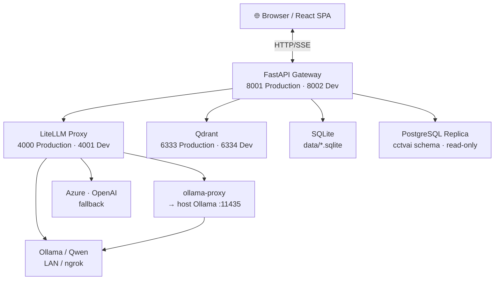
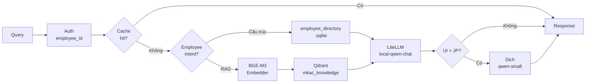
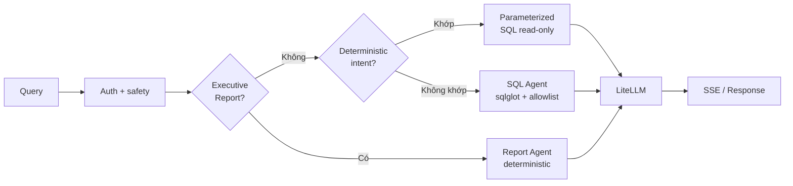
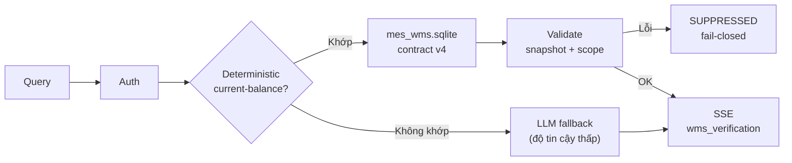
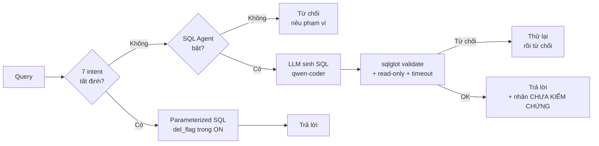
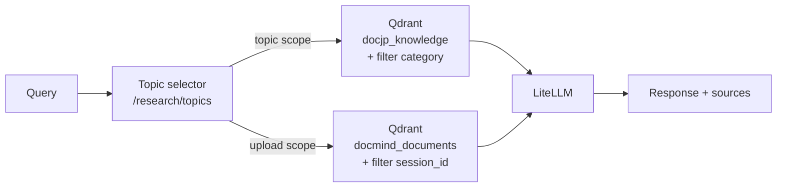
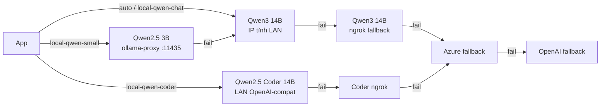
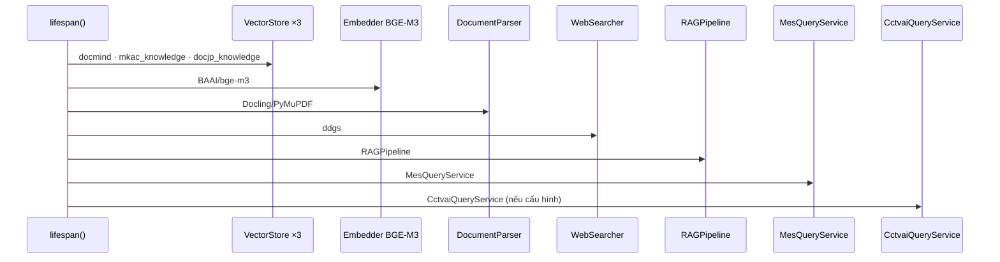
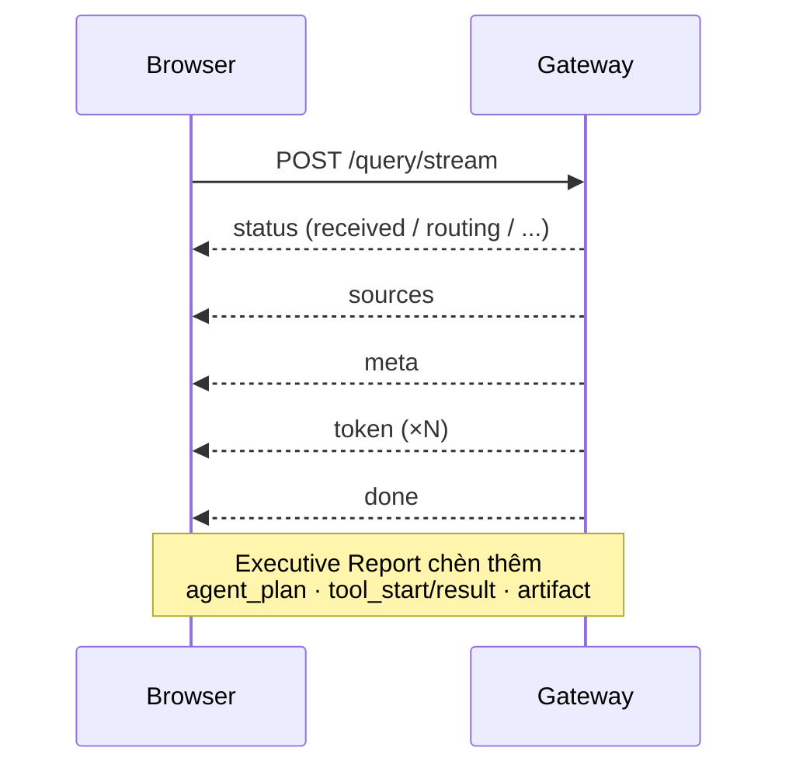

# Kiến trúc hệ thống Meibook

> Tài liệu tóm tắt kiến trúc `VLLM-PD`. Trạng thái vận hành (số chunk, model
> endpoint, URL ngrok) có thể thay đổi — xác nhận bằng lệnh ở phần **Vận hành**.
> Runtime phải xác định theo checkout thực tế, không suy từ tài liệu này.

---

## 1. Năm chế độ hỏi đáp

| Mode | `mode=` | Nguồn dữ liệu | Ghi chú |
|---|---|---|---|
| Hỏi đáp hành chính nhân sự | `mkac` | SQLite nhân sự + Qdrant `mkac_knowledge` | Hỗ trợ VI/JP, ddgs web fallback |
| Quản lý sản xuất MES | `mes` | SQLite `data/mes.sqlite` (read-only) | Deterministic trước, SQL Agent fallback |
| Quản lý kho WMS | `wms` | SQLite `data/mes_wms.sqlite` (read-only) | Fail-closed, không fallback sang MES |
| Camera AI CCTVAI | `cctvai` | PostgreSQL replica `cctvai` schema (read-only) | Replica không realtime; Dev bật mặc định |
| Nghiên cứu tài liệu | `research` | Qdrant `docjp_knowledge` (theo topic) | Upload session dùng `docmind_documents` |

---

## 2. Kiến trúc tổng quan



---

## 3. Luồng xử lý theo mode

### 3.1 MKAC — Hỏi đáp nhân sự



### 3.2 MES — Quản lý sản xuất



### 3.3 WMS — Quản lý kho



> WMS không truy vấn MES snapshot, MES SQL Agent hoặc MES API trong bất kỳ
> trường hợp nào. Câu hỏi tiếng Nhật giữ nguyên để bảo toàn mã vật tư/công đoạn.

### 3.4 CCTVAI — Camera giám sát AI



**Ba ràng buộc bắt buộc của CCTVAI:**

| Vấn đề | Nguyên nhân | Hậu quả nếu sai |
|---|---|---|
| `del_flag` trong `ON` của JOIN | `camera_id`/`violation_code` không unique trên toàn bảng | Tăng 43% số dòng — số liệu sai hoàn toàn |
| `detected_time` là epoch **ms** | Không phải giây | Lệch hàng nghìn năm |
| Liệt kê cột tường minh | Quyền cấp theo cột, `SELECT *` bị từ chối | Lỗi permission |

### 3.5 Research — Nghiên cứu tài liệu



---

## 4. Model routing



> Qwen3 **phải** dùng provider `ollama_chat` (không phải `/v1`); `/v1` trả
> reasoning nhưng rỗng `message.content`.

---

## 5. Cổng và môi trường

| Thành phần | Production | Dev |
|---|:---:|:---:|
| FastAPI + React SPA | `8001` | `8002` |
| LiteLLM Proxy | `4000` | `4001` |
| Qdrant | `6333` | `6334` |
| Compose file | `docker-compose.web.yml` | `docker-compose.dev.yml` |
| Checkout | `/home/jkl/Code/VLLM-PD` · `main` | `/home/jkl/Code/VLLM-PD-dev` · `dev` |
| WMS bật | ❌ | ✅ |
| CCTVAI bật | main (schema đã merge) | ✅ |

**Ranh giới dữ liệu:** SQLite, Qdrant storage, uploads, logs, credentials Dev và
Production là tách biệt hoàn toàn. Không copy/merge dữ liệu runtime giữa hai môi
trường.

---

## 6. Khởi động — thứ tự singleton



Các singleton import-time: `EmployeeDirectory`, `MesDatabase`, `GmailSender`,
`TranslationService`, `CctvaiHardwareService`.

---

## 7. SSE event sequence



---

## 8. Bảo mật — tóm tắt

| Lớp | Biện pháp |
|---|---|
| Upload | Allowlist extension · giới hạn dung lượng/trang PDF · semaphore |
| MES/WMS SQLite | Read-only · parameterized query · SQL Agent qua sqlglot + authorizer |
| CCTVAI PostgreSQL | Role `cctvai_llm_ro` · quyền cấp theo cột · statement timeout |
| LiteLLM / Qdrant | Bind `127.0.0.1` trong Docker |
| Gmail | Scope send-only · token/credentials trong `data/` không commit |
| Coding Agent | Tắt mặc định `ENABLE_AGENT=false` |

**Giới hạn còn lại:** `employee_id` là access gate đơn giản (chưa có auth
user/tenant đầy đủ); rate limit/cache in-memory; CORS còn rộng.

---

## 9. Bố cục mã nguồn chính

```
src/
├── api/          main.py · schemas.py · config.py · sse.py
├── rag/          rag_pipeline.py · embedder.py · vector_store.py · parser.py
├── auth/         employee_directory.py · employee_intent.py
├── actions/      report_intent.py · report_agent.py · artifact_store.py
├── integrations/ mes_*.py · cctvai_*.py · gmail_sender.py
├── i18n/         translation.py
└── agent/        LangGraph Coding Agent (tắt trong Docker web)
tools/
└── host_metrics/ schemas.py  ← dùng chung với CCTVAI hardware collector
config/           quick_answers.json · mkac_manifest.json · *_semantic_model.json
database/         raw_mkac/ · schema/mes.sql · schema/mes_wms.sql
documents/        MKAC/ · MKAC-md/ · Research/DocJP/
Markdowns/        tài liệu dự án (xem README.md để tra cứu)
```

---

## 10. Vận hành nhanh

```bash
# Preflight Dev
cd /home/jkl/Code/VLLM-PD-dev && git branch --show-current   # dev
docker compose -f docker-compose.dev.yml config -q
docker compose -f docker-compose.dev.yml ps

# Liveness check Dev
curl -fsS http://localhost:8002/health | jq .
curl -fsS http://localhost:4001/health/liveliness
curl -fsS http://localhost:6334/healthz

# Liveness check Production
curl -fsS http://localhost:8001/health | jq .
```

> **Test:** `scripts/meibook-python -m pytest tests/ -q`
> — không dùng bare `python`/`pytest`; không chạy `docker-compose.web.yml` khi
> đang trong checkout Dev.

---

*Tài liệu liên quan: [`DATABASE.md`](DATABASE.md) · [`DEPLOY.md`](DEPLOY.md) ·
[`TestPrompt.md`](TestPrompt.md) · [`CCTVAI_HARDWARE.md`](CCTVAI_HARDWARE.md)*
