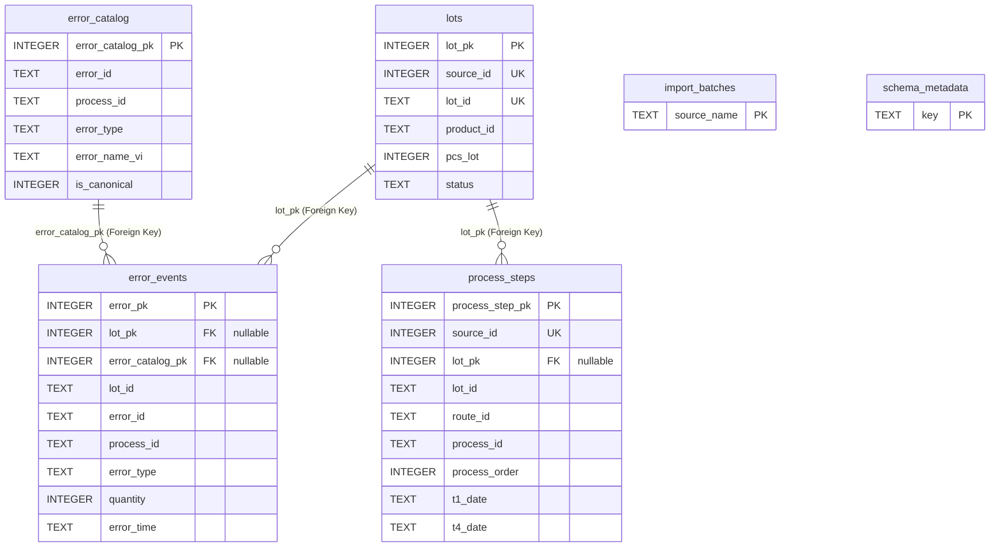

# Thiết kế cơ sở dữ liệu Meibook

Tài liệu này mô tả các lớp dữ liệu hiện tại của Meibook: Qdrant cho tài liệu,
SQLite cho nhân sự, SQLite cho MES snapshot và các thư mục nguồn phục vụ import.

## 1. Tổng quan

Meibook không dùng một database duy nhất. Hệ thống chia dữ liệu theo mục đích:

| Lớp dữ liệu | Công nghệ | File/Collection | Mục đích |
|---|---|---|---|
| Tài liệu MKAC | Qdrant | `mkac_knowledge` | RAG hành chính nhân sự |
| Tài liệu research legacy | Qdrant | `docmind_documents` | Upload/research theo session và demo 2 tài liệu |
| Tài liệu Research DocJP | Qdrant | `docjp_knowledge` | Research theo topic tài liệu nội bộ Nhật |
| Danh bạ nhân sự | SQLite | `data/employee_directory.sqlite` | Đăng nhập, tra nhân sự/phòng ban |
| MES snapshot | SQLite | `data/mes.sqlite` | Hỏi đáp MES deterministic/SQL |
| MES raw source | SQL dump | `database/raw_mkac/*.sql` | Nguồn tạo `data/mes.sqlite` |
| Gmail OAuth | JSON | `data/gmail_credentials.json`, `data/gmail_token.json` | Gửi mail qua Gmail API |

Thư mục `data/` và các dump raw nhạy cảm không nên commit.

## 2. Qdrant tài liệu MKAC

Collection:

```text
mkac_knowledge
```

Vai trò:

- Lưu vector tài liệu hành chính, nhân sự, nội quy, quy trình MKAC.
- Dùng trong `mode=mkac`.
- Payload giữ `source_file`, `page_number`, `chunk_index`, `metadata`.
- Có thể mở preview trang nguồn qua ảnh trong `mkac_processed/pages`.

Trạng thái API gần nhất:

| Chỉ số | Giá trị |
|---|---:|
| Số tài liệu MKAC | `18` |
| Số chunk | `192` |
| Collection | `mkac_knowledge` |

Danh sách file đang có trong collection gồm các tài liệu như:

- `0. Thong tin nhan su va lanh dao MKAC.html`
- `3. DANH SÁCH KHÁM SỨC KHOẺ 2026.pdf`
- `4. Noi quy lao dong_MKAC 12.7.2021.pdf`
- `Quy định công tác nước ngoài.pdf`
- `Quy định công tác trong nước.pdf`
- `Quy định giờ làm thêm.pdf`

## 3. Text source curated cho MKAC

Hiện tại index MKAC ưu tiên nguồn text đã trích xuất rõ hơn:

```text
documents/MKAC-md/
```

Tài liệu gốc vẫn giữ ở:

```text
documents/MKAC/
```

Ý nghĩa:

- `documents/MKAC-md`: dùng để tạo chunk có nội dung sạch hơn, ít lỗi OCR hơn.
- `documents/MKAC`: dùng làm file gốc và hiển thị trích dẫn/preview.
- `mkac_processed/pages`: lưu ảnh trang để frontend xem nguồn tham chiếu.

Số file kiểm tra gần nhất:

| Đường dẫn | Số file |
|---|---:|
| `documents/MKAC-md` | `19` |
| `documents/MKAC` | `19` |
| `mkac_processed/pages` | khoảng `108` ảnh |

## 4. Qdrant tài liệu research legacy

Collection:

```text
docmind_documents
```

Vai trò:

- Lưu tài liệu upload theo UUID session.
- Dùng cho `mode=research`.
- Hiện là luồng legacy/fallback. UI Research mới ưu tiên topic DocJP, nhưng
  upload/session demo cũ vẫn được giữ để dùng tài liệu demo hoặc mở rộng sau.

Session demo research cố định:

```text
00000000-0000-4000-8000-000000000001
```

Trạng thái demo gần nhất:

| Chỉ số | Giá trị |
|---|---:|
| Số tài liệu demo | `2` |
| Số chunk | `39` |

## 5. Qdrant tài liệu Research DocJP

Collection:

```text
docjp_knowledge
```

Vai trò:

- Là luồng Research chính hiện tại trên UI.
- Lưu bộ tài liệu nội bộ Nhật đã OCR/chuẩn hóa.
- Retrieval dùng session logic cố định `docjp`.
- Scope tìm kiếm được thu hẹp bằng metadata `category` theo topic.

Nguồn tài liệu:

```text
documents/Research/DocJP/
documents/Research/DocJP_md/
config/docjp_manifest.json
```

Topic registry:

```text
config/research_topics.json
```

Các topic hiện có:

| Topic | Metadata category |
|---|---|
| Công nghệ thông tin & Bảo mật | `information_systems` |
| Pháp chế & Quản lý rủi ro | `legal_compliance` |
| Kế toán | `accounting` |
| Hành chính tổng hợp | `general_affairs` |

Trạng thái Qdrant gần nhất:

| Chỉ số | Giá trị |
|---|---:|
| Collection | `docjp_knowledge` |
| Số vector/point | `678` |

## 6. SQLite danh bạ nhân sự

File:

```text
data/employee_directory.sqlite
```

Nguồn tạo:

```text
documents/MKAC/3. DANH SÁCH KHÁM SỨC KHOẺ 2026.pdf
documents/MKAC/0. Thong tin nhan su va lanh dao MKAC.html
```

Vai trò:

- Xác thực mã nhân viên 6 chữ số khi vào `mkac` hoặc `mes`.
- Trả lời trực tiếp các câu hỏi có cấu trúc về nhân sự/phòng ban.
- Cấp context người dùng hiện tại cho RAG.
- Hỗ trợ câu nối tiếp qua `conversation_context`, ví dụ “anh này làm vai trò gì?”.

Trạng thái hiện tại:

| Chỉ số | Giá trị |
|---|---:|
| Nhân viên trong SQLite | `154` |

ID đặc biệt:

| ID | Ý nghĩa |
|---|---|
| `000000` | Guest demo, tạo bằng code, không cần có trong SQLite |
| `000001` | Nguyễn Văn Thuận, Ban Giám đốc |

Các nhóm intent nhân sự:

- hỏi “tôi là ai”, “tôi ở phòng nào”;
- hỏi một người theo tên/mã;
- hỏi số người trong công ty;
- hỏi danh sách phòng ban;
- hỏi phòng nào đông nhất;
- hỏi trưởng/phó phòng;
- hỏi phòng ban vừa nhắc ở lượt trước.

## 7. MES raw source hiện tại

Bộ dữ liệu MES đang dùng là bộ mới trong:

```text
database/raw_mkac/
├── D_ERROR_202606251410.sql
├── M_LOT_202606251410.sql
└── P_ERROR_202606251411.sql
```

Bộ `database/raw/` cũ không còn được dùng vì yêu cầu bảo mật dữ liệu.

Ý nghĩa ba file:

| File | Bảng nguồn | Ý nghĩa |
|---|---|---|
| `M_LOT_*.sql` | `M_LOT` | Thông tin Lot, mã hàng, trạng thái, ngày |
| `D_ERROR_*.sql` | `D_ERROR` | Sự kiện lỗi theo Lot/process/mã lỗi/số lượng |
| `P_ERROR_*.sql` | `P_ERROR` | Danh mục mã lỗi và tên lỗi |

Mapping tên lỗi phải dùng khóa đầy đủ:

```text
D_ERROR.ERROR_ID   = P_ERROR.ERROR_ID
D_ERROR.PROCESS_ID = P_ERROR.PROCESS_ID
D_ERROR.ERROR_TYPE = P_ERROR.ERROR_TYPE
```

Không nên chỉ nối bằng `ERROR_ID`, vì cùng mã lỗi có thể xuất hiện ở nhiều
process hoặc loại lỗi khác nhau.

## 8. SQLite MES snapshot

File:

```text
data/mes.sqlite
```

Schema:

```text
database/schema/mes.sql
```

Importer:

```text
scripts/import_mes_database.py
```

### Bảng chính

| Bảng | Mục đích |
|---|---|
| `lots` | Lot đã chuẩn hóa từ `M_LOT` |
| `error_events` | Bản ghi lỗi đã chuẩn hóa từ `D_ERROR` |
| `error_catalog` | Danh mục lỗi đã chuẩn hóa từ `P_ERROR` |
| `import_batches` | Metadata file import |
| `schema_metadata` | Phiên bản schema và chỉ số chất lượng |

### Sơ đồ quan hệ thực thể (ERD)



*Chú thích về liên kết:*

- Quan hệ giữa `lots` và `error_events` là 1 - Nhiều (One-to-Many) qua trường `lot_pk`. Trường này cho phép `NULL` (nullable) để lưu các sự kiện lỗi chưa khớp được với lô hàng cụ thể.
- Quan hệ giữa `error_catalog` và `error_events` là 1 - Nhiều (One-to-Many) qua trường `error_catalog_pk`. Trường này cũng cho phép `NULL` khi mã lỗi chưa định nghĩa trong từ điển.
- Quan hệ giữa `lots` và `process_steps` là 1 - Nhiều qua `lot_pk` nullable; công đoạn từ `D_MAIN` không khớp được Lot vẫn được giữ để đo chất lượng dữ liệu. Bảng chuẩn hóa và các view công đoạn không lưu/trả về `USER_ID`, `STAFF_ID`, `STAFF_NAME`, `NOTE`.
- Hai bảng `import_batches` và `schema_metadata` là các bảng hệ thống độc lập, không có khóa ngoại (Foreign Key) liên kết trực tiếp với các bảng nghiệp vụ chính.
- **Lưu ý nghiệp vụ:** Khi thực hiện phép kết (Join) hoặc mapping lỗi thủ công bằng mã lỗi, **bắt buộc** phải khớp tổ hợp 3 trường `(error_id, process_id, error_type)` thay vì chỉ dùng `error_id` độc nhất.

### View phục vụ query

| View | Mục đích |
|---|---|
| `v_error_details` | Chi tiết lỗi đã nối Lot, mã hàng, tên lỗi |
| `v_lot_error_summary` | Tổng lỗi theo Lot |
| `v_lot_error_breakdown` | Phân rã lỗi theo Lot/process/mã lỗi |
| `v_product_error_summary` | Tổng lỗi theo mã hàng |

Các view này là lớp công khai cho SQL Agent. Model không được truy cập bảng raw
trực tiếp.

## 9. Chất lượng dữ liệu MES hiện tại

Theo `/health` gần nhất:

| Chỉ số | Giá trị |
|---|---:|
| Raw lots | `2592` |
| Lot hiển thị sau khi loại test | `1325` |
| Lot test bị loại | `1267` |
| Raw error events | `654` |
| Error events hiển thị | `281` |
| Error events test bị loại | `373` |
| Error catalog | `969` |
| Tên lỗi chưa mapping | `2` |
| Imported at | `2026-06-25T09:25:15.464307+00:00` |

Truy vấn trực tiếp `data/mes.sqlite` cho thấy tổng bảng raw:

| Bảng | Số dòng |
|---|---:|
| `lots` | `2592` |
| `error_events` | `654` |
| `error_catalog` | `969` |

## 10. Loại dữ liệu test

Hệ thống loại dữ liệu test khỏi câu trả lời MES.

Điều kiện loại test nằm trong `MesDatabase._exclude_test_filter()` và các view
SQL Agent cũng được thiết kế để không trả dữ liệu test. Về mặt nghiệp vụ hiện
tại, các mã có token `test` trong `product_id` hoặc `lot_id` không được đưa vào
câu trả lời.

Ví dụ số liệu hiện tại:

| Nhóm | Raw | Sau loại test |
|---|---:|---:|
| Lot | `2592` | `1325` |
| Error events | `654` | `281` |

## 11. Top Lot hiện tại sau khi loại test

Truy vấn kiểm tra gần nhất:

| Lot | Mã hàng | Tổng lỗi |
|---|---|---:|
| `000866-05-000` | `KHTH_05` | `12870` |
| `000866-01-000` | `KHTH_05` | `11856` |
| `000943-03-000` | `0303-0303` | `10920` |
| `000866-02-000` | `KHTH_05` | `4680` |
| `000863-01-000` | `KHTH_06` | `3510` |

Các câu hỏi hoặc test cũ nhắc `000346-01-000`, `000432-01-000`, `3736-0008`
có thể đã lệch với database mới.

## 12. MesDatabase query service

`src/integrations/mes_database.py` mở SQLite read-only:

```text
file:/.../data/mes.sqlite?mode=ro
PRAGMA query_only=ON
```

Nó không nối câu hỏi người dùng vào SQL. Các intent phổ biến được ánh xạ sang
truy vấn tham số hóa cố định.

Intent deterministic chính:

- thông tin một Lot;
- danh sách/chi tiết lỗi theo Lot;
- số bản ghi lỗi của Lot;
- số loại lỗi khác nhau của Lot;
- tổng lỗi/số lot/trung bình lỗi theo mã hàng;
- mã hàng có tổng lỗi cao nhất hoặc đứng thứ N;
- Lot nhiều lỗi nhất, ít lỗi nhất, đứng thứ N;
- mapping mã lỗi sang tên lỗi/process;
- tìm theo tên lỗi tiếng Việt;
- các Lot có một mã lỗi hoặc tên lỗi;
- tổng hợp theo ngày/tháng qua lớp time-SQL;
- câu mơ hồ như “Có bao nhiêu lot?” sẽ hỏi lại phạm vi.

## 13. SQL Agent MES

SQL Agent nằm ở:

```text
src/integrations/mes_sql_agent.py
```

Semantic model:

```text
config/mes_semantic_model.json
```

Nguyên tắc an toàn:

1. LLM chỉ thấy data dictionary và các view allowlist.
2. LLM sinh JSON plan chứa một câu `SELECT` hoặc `WITH ... SELECT`.
3. Backend parse bằng `sqlglot`.
4. Chặn DDL/DML/`ATTACH`/`PRAGMA`/multi-statement.
5. Chỉ cho truy cập các view công khai.
6. Ép `LIMIT`.
7. SQLite mở read-only và có authorizer read-only.
8. Timeout ngắn.
9. Nếu LLM diễn đạt thiếu số liệu, trả fallback deterministic.

SQL Agent dùng `local-qwen-coder` theo biến:

```text
MES_SQL_AGENT_MODEL=local-qwen-coder
```

## 14. Dữ liệu cho model

Model không được “nhìn thẳng” vào SQLite. Backend truy vấn trước, sau đó chỉ đưa
JSON kết quả đã kiểm chứng vào prompt.

Các khái niệm cần giữ rõ:

| Khái niệm | Ý nghĩa |
|---|---|
| `lot_id` | Mã Lot |
| `product_id` | Mã hàng/sản phẩm |
| `quantity` | Số lượng lỗi trong một event |
| `total_error_qty` | Tổng số lượng lỗi |
| `error_record_count` | Số bản ghi/sự kiện lỗi |
| `error_id` | Mã lỗi |
| `error_name` | Tên lỗi, ưu tiên `ERROR_NAME_VI` |
| `process_id` | Công đoạn phát hiện lỗi |

Không được suy đoán tên lỗi nếu mapping rỗng. Câu trả lời phải nói rõ “lỗi chưa
rõ tên” hoặc “chưa mapping tên lỗi”.

## 15. Cache dữ liệu

Cache câu hỏi nằm ở API layer:

- `QUERY_RESPONSE_CACHE_TTL_SECONDS=600` cho câu hỏi thường.
- `MES_QUERY_CACHE_TTL_SECONDS=86400` cho MES snapshot.
- `QUERY_RESPONSE_CACHE_SIZE=256`.

Cache key có gắn mode, ngôn ngữ, model, employee và metadata snapshot. Các câu
phụ thuộc `conversation_context` không cache để tránh trả nhầm lượt trước.

## 16. Backup và không commit

Nên backup:

```text
data/mes.sqlite
data/employee_directory.sqlite
data/gmail_credentials.json
data/gmail_token.json
qdrant_storage/
documents/MKAC/
documents/MKAC-md/
mkac_processed/
logs/
```

Không nên commit:

```text
data/
database/raw/
database/raw_mkac/
*.sqlite
gmail_token.json
gmail_credentials.json
client_secret_*.json
```

## 17. Kiểm tra nhanh

Kiểm tra health database:

```bash
curl -fsS http://localhost:8001/health | jq '.mes_database, .employee_directory'
```

Kiểm tra MKAC Qdrant:

```bash
curl -fsS http://localhost:8001/knowledge/mkac/status | jq .
```

Kiểm tra SQLite MES trực tiếp:

```bash
sqlite3 data/mes.sqlite \
  "SELECT key, value FROM schema_metadata ORDER BY key;"
```

Kiểm tra top Lot đã loại test:

```bash
sqlite3 data/mes.sqlite "
SELECT product_id, lot_id, total_error_qty
FROM v_lot_error_summary
WHERE lower(product_id) NOT LIKE '%test%'
  AND lower(lot_id) NOT LIKE '%test%'
ORDER BY total_error_qty DESC
LIMIT 5;"
```
