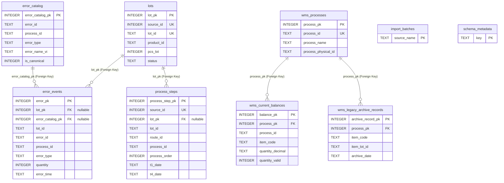
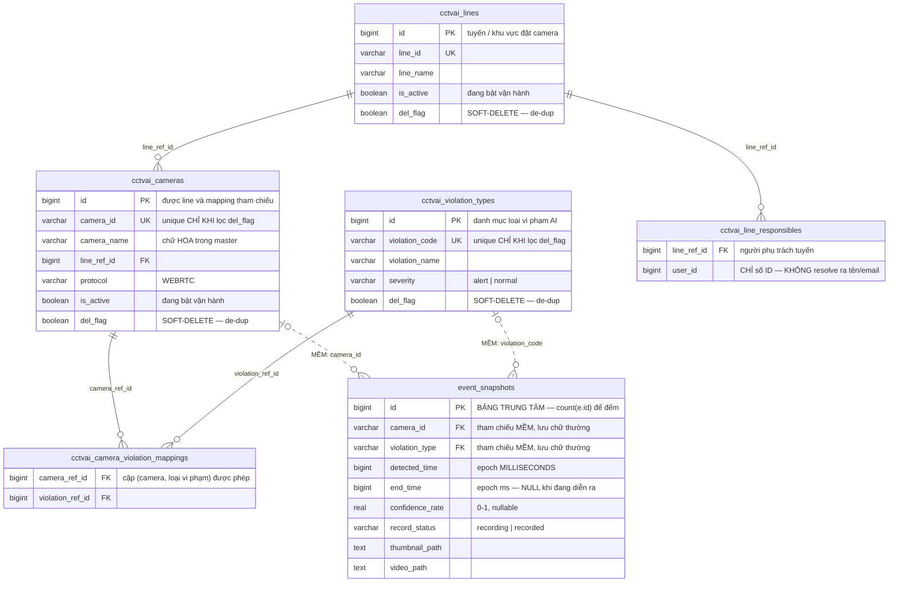
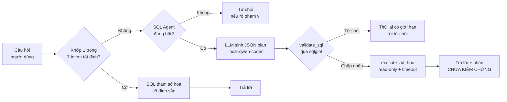

# Thiết kế cơ sở dữ liệu Meibook

Tài liệu này mô tả các lớp dữ liệu hiện tại của Meibook: Qdrant cho tài liệu,
SQLite cho nhân sự, SQLite cho MES snapshot, PostgreSQL replica cho CCTVAI và
các thư mục nguồn phục vụ import.

## 1. Tổng quan

Meibook không dùng một database duy nhất. Hệ thống chia dữ liệu theo mục đích:

| Lớp dữ liệu | Công nghệ | File/Collection | Mục đích |
|---|---|---|---|
| Tài liệu MKAC | Qdrant | `mkac_knowledge` | RAG hành chính nhân sự |
| Tài liệu research legacy | Qdrant | `docmind_documents` | Upload/research theo session và demo 2 tài liệu |
| Tài liệu Research DocJP | Qdrant | `docjp_knowledge` | Research theo topic tài liệu nội bộ Nhật |
| Danh bạ nhân sự | SQLite | `data/employee_directory.sqlite` | Đăng nhập, tra nhân sự/phòng ban |
| MES snapshot | SQLite | `data/mes.sqlite` | Hỏi đáp MES deterministic/SQL |
| MES raw source | SQL dump | `database/raw_mkac/*.sql` | Nguồn tạo `data/mes.sqlite` |
| CCTVAI replica | PostgreSQL | schema `cctvai` (host ngoài) | Hỏi đáp/báo cáo camera AI — xem mục 9 |
| Gmail OAuth | JSON | `data/gmail_credentials.json`, `data/gmail_token.json` | Gửi mail qua Gmail API |

Thư mục `data/` và các dump raw nhạy cảm không nên commit.

CCTVAI là lớp dữ liệu duy nhất **không nằm trong repo**: nó là replica chỉ đọc
của một PostgreSQL bên ngoài, hiện chỉ bật trên môi trường Dev.

## 2. Qdrant tài liệu MKAC

Collection:

```text
mkac_knowledge
```

Vai trò:

- Lưu vector tài liệu hành chính, nhân sự, nội quy, quy trình MKAC.
- Dùng trong `mode=mkac`.
- Payload giữ `source_file`, `page_number`, `chunk_index`, `metadata`.
- Có thể mở preview trang nguồn qua ảnh trong `mkac_processed/pages`.

Trạng thái API gần nhất:

| Chỉ số | Giá trị |
|---|---:|
| Số tài liệu MKAC | `18` |
| Số chunk | `192` |
| Collection | `mkac_knowledge` |

Danh sách file đang có trong collection gồm các tài liệu như:

- `0. Thong tin nhan su va lanh dao MKAC.html`
- `3. DANH SÁCH KHÁM SỨC KHOẺ 2026.pdf`
- `4. Noi quy lao dong_MKAC 12.7.2021.pdf`
- `Quy định công tác nước ngoài.pdf`
- `Quy định công tác trong nước.pdf`
- `Quy định giờ làm thêm.pdf`

## 3. Text source curated cho MKAC

Hiện tại index MKAC ưu tiên nguồn text đã trích xuất rõ hơn:

```text
documents/MKAC-md/
```

Tài liệu gốc vẫn giữ ở:

```text
documents/MKAC/
```

Ý nghĩa:

- `documents/MKAC-md`: dùng để tạo chunk có nội dung sạch hơn, ít lỗi OCR hơn.
- `documents/MKAC`: dùng làm file gốc và hiển thị trích dẫn/preview.
- `mkac_processed/pages`: lưu ảnh trang để frontend xem nguồn tham chiếu.

Số file kiểm tra gần nhất:

| Đường dẫn | Số file |
|---|---:|
| `documents/MKAC-md` | `19` |
| `documents/MKAC` | `19` |
| `mkac_processed/pages` | khoảng `108` ảnh |

## 4. Qdrant tài liệu research legacy

Collection:

```text
docmind_documents
```

Vai trò:

- Lưu tài liệu upload theo UUID session.
- Dùng cho `mode=research`.
- Hiện là luồng legacy/fallback. UI Research mới ưu tiên topic DocJP, nhưng
  upload/session demo cũ vẫn được giữ để dùng tài liệu demo hoặc mở rộng sau.

Session demo research cố định:

```text
00000000-0000-4000-8000-000000000001
```

Trạng thái demo gần nhất:

| Chỉ số | Giá trị |
|---|---:|
| Số tài liệu demo | `2` |
| Số chunk | `39` |

## 5. Qdrant tài liệu Research DocJP

Collection:

```text
docjp_knowledge
```

Vai trò:

- Là luồng Research chính hiện tại trên UI.
- Lưu bộ tài liệu nội bộ Nhật đã OCR/chuẩn hóa.
- Retrieval dùng session logic cố định `docjp`.
- Scope tìm kiếm được thu hẹp bằng metadata `category` theo topic.

Nguồn tài liệu:

```text
documents/Research/DocJP/
documents/Research/DocJP_md/
config/docjp_manifest.json
```

Topic registry:

```text
config/research_topics.json
```

Các topic hiện có:

| Topic | Metadata category |
|---|---|
| Công nghệ thông tin & Bảo mật | `information_systems` |
| Pháp chế & Quản lý rủi ro | `legal_compliance` |
| Kế toán | `accounting` |
| Hành chính tổng hợp | `general_affairs` |

Trạng thái Qdrant gần nhất:

| Chỉ số | Giá trị |
|---|---:|
| Collection | `docjp_knowledge` |
| Số vector/point | `678` |

## 6. SQLite danh bạ nhân sự

File:

```text
data/employee_directory.sqlite
```

Nguồn tạo:

```text
documents/MKAC/3. DANH SÁCH KHÁM SỨC KHOẺ 2026.pdf
documents/MKAC/0. Thong tin nhan su va lanh dao MKAC.html
```

Vai trò:

- Xác thực mã nhân viên 6 chữ số khi vào `mkac` hoặc `mes`.
- Trả lời trực tiếp các câu hỏi có cấu trúc về nhân sự/phòng ban.
- Cấp context người dùng hiện tại cho RAG.
- Hỗ trợ câu nối tiếp qua `conversation_context`, ví dụ “anh này làm vai trò gì?”.

Trạng thái hiện tại:

| Chỉ số | Giá trị |
|---|---:|
| Nhân viên trong SQLite | `154` |

ID đặc biệt:

| ID | Ý nghĩa |
|---|---|
| `000000` | Guest demo, tạo bằng code, không cần có trong SQLite |
| `000001` | Nguyễn Văn Thuận, Ban Giám đốc |

Các nhóm intent nhân sự:

- hỏi “tôi là ai”, “tôi ở phòng nào”;
- hỏi một người theo tên/mã;
- hỏi số người trong công ty;
- hỏi danh sách phòng ban;
- hỏi phòng nào đông nhất;
- hỏi trưởng/phó phòng;
- hỏi phòng ban vừa nhắc ở lượt trước.

## 7. MES raw source hiện tại

Bộ dữ liệu MES đang dùng là bộ mới trong:

```text
database/raw_mkac/
├── D_ERROR_202606251410.sql
├── M_LOT_202606251410.sql
└── P_ERROR_202606251411.sql
```

Bộ `database/raw/` cũ không còn được dùng vì yêu cầu bảo mật dữ liệu.

Ý nghĩa ba file:

| File | Bảng nguồn | Ý nghĩa |
|---|---|---|
| `M_LOT_*.sql` | `M_LOT` | Thông tin Lot, mã hàng, trạng thái, ngày |
| `D_ERROR_*.sql` | `D_ERROR` | Sự kiện lỗi theo Lot/process/mã lỗi/số lượng |
| `P_ERROR_*.sql` | `P_ERROR` | Danh mục mã lỗi và tên lỗi |

Mapping tên lỗi phải dùng khóa đầy đủ:

```text
D_ERROR.ERROR_ID   = P_ERROR.ERROR_ID
D_ERROR.PROCESS_ID = P_ERROR.PROCESS_ID
D_ERROR.ERROR_TYPE = P_ERROR.ERROR_TYPE
```

Không nên chỉ nối bằng `ERROR_ID`, vì cùng mã lỗi có thể xuất hiện ở nhiều
process hoặc loại lỗi khác nhau.

## 8. SQLite MES snapshot

File:

```text
data/mes.sqlite
```

Schema:

```text
database/schema/mes.sql
```

Importer:

```text
scripts/import_mes_database.py
```

### Bảng chính

| Bảng | Mục đích |
|---|---|
| `lots` | Lot đã chuẩn hóa từ `M_LOT` |
| `error_events` | Bản ghi lỗi đã chuẩn hóa từ `D_ERROR` |
| `error_catalog` | Danh mục lỗi đã chuẩn hóa từ `P_ERROR` |
| `import_batches` | Metadata file import |
| `schema_metadata` | Phiên bản schema và chỉ số chất lượng |

### Sơ đồ quan hệ thực thể (ERD)


```mermaid
erDiagram
    lots ||--o{ error_events : "lot_pk (Foreign Key)"
    lots ||--o{ process_steps : "lot_pk (Foreign Key)"
    error_catalog ||--o{ error_events : "error_catalog_pk (Foreign Key)"
    wms_processes ||--o{ wms_current_balances : "process_pk (Foreign Key)"
    wms_processes ||--o{ wms_legacy_archive_records : "process_pk (Foreign Key)"

    lots {
        INTEGER lot_pk PK
        INTEGER source_id UK
        TEXT lot_id UK
        TEXT product_id
        INTEGER pcs_lot
        TEXT status
    }
    error_events {
        INTEGER error_pk PK
        INTEGER lot_pk FK "nullable"
        INTEGER error_catalog_pk FK "nullable"
        TEXT lot_id
        TEXT error_id
        TEXT process_id
        TEXT error_type
        INTEGER quantity
        TEXT error_time
    }
    error_catalog {
        INTEGER error_catalog_pk PK
        TEXT error_id
        TEXT process_id
        TEXT error_type
        TEXT error_name_vi
        INTEGER is_canonical
    }
    process_steps {
        INTEGER process_step_pk PK
        INTEGER source_id UK
        INTEGER lot_pk FK "nullable"
        TEXT lot_id
        TEXT route_id
        TEXT process_id
        INTEGER process_order
        TEXT t1_date
        TEXT t4_date
    }
    wms_processes {
        INTEGER process_pk PK
        TEXT process_id UK
        TEXT process_name
        TEXT process_physical_id
    }
    wms_current_balances {
        INTEGER balance_pk PK
        INTEGER process_pk FK
        TEXT process_id
        TEXT item_code
        TEXT quantity_decimal
        INTEGER quantity_valid
    }
    wms_legacy_archive_records {
        INTEGER archive_record_pk PK
        INTEGER process_pk FK
        TEXT item_code
        TEXT item_lot_id
        TEXT archive_date
    }
    import_batches {
        TEXT source_name PK
    }
    schema_metadata {
        TEXT key PK
    }
```

*Chú thích về liên kết:*

- Quan hệ giữa `lots` và `error_events` là 1 - Nhiều (One-to-Many) qua trường `lot_pk`. Trường này cho phép `NULL` (nullable) để lưu các sự kiện lỗi chưa khớp được với lô hàng cụ thể.
- Quan hệ giữa `error_catalog` và `error_events` là 1 - Nhiều (One-to-Many) qua trường `error_catalog_pk`. Trường này cũng cho phép `NULL` khi mã lỗi chưa định nghĩa trong từ điển.
- Quan hệ giữa `lots` và `process_steps` là 1 - Nhiều qua `lot_pk` nullable; công đoạn từ `D_MAIN` không khớp được Lot vẫn được giữ để đo chất lượng dữ liệu. Bảng chuẩn hóa và các view công đoạn không lưu/trả về `USER_ID`, `STAFF_ID`, `STAFF_NAME`, `NOTE`.
- Hai bảng `import_batches` và `schema_metadata` là các bảng hệ thống độc lập, không có khóa ngoại (Foreign Key) liên kết trực tiếp với các bảng nghiệp vụ chính.
- **Lưu ý nghiệp vụ:** Khi thực hiện phép kết (Join) hoặc mapping lỗi thủ công bằng mã lỗi, **bắt buộc** phải khớp tổ hợp 3 trường `(error_id, process_id, error_type)` thay vì chỉ dùng `error_id` độc nhất.

### View phục vụ query

| View | Mục đích |
|---|---|
| `v_error_details` | Chi tiết lỗi đã nối Lot, mã hàng, tên lỗi |
| `v_lot_error_summary` | Tổng lỗi theo Lot |
| `v_lot_error_breakdown` | Phân rã lỗi theo Lot/process/mã lỗi |
| `v_product_error_summary` | Tổng lỗi theo mã hàng |

Các view này là lớp công khai cho SQL Agent. Model không được truy cập bảng raw
trực tiếp.

## 9. PostgreSQL replica CCTVAI

Lớp dữ liệu cho `mode=cctvai` (hỏi đáp camera giám sát AI và báo cáo tổng quan).
Đây là **replica chỉ đọc** đồng bộ bất đồng bộ từ database CCTVAI thật, **không**
phải dữ liệu realtime.

| Thuộc tính | Giá trị |
|---|---|
| Công nghệ | PostgreSQL (host ngoài, không nằm trong Compose) |
| Schema | `cctvai` |
| Role | `cctvai_llm_ro` — chỉ `SELECT`, quyền cấp ở **mức cột** |
| Môi trường | Chỉ bật trên Dev (`docker-compose.dev.yml`, port `8002`) |
| Semantic model | `config/cctvai_semantic_model.json` |
| Query service | `src/integrations/cctvai_database.py` |
| SQL Agent | `src/integrations/cctvai_sql_agent.py` |
| Report Agent | `CctvaiReportAgent` trong `src/actions/report_agent.py` |
| Phiên bản migration | `19` |
| Hợp đồng dữ liệu | `cctvai-replica-v1` / `cctvai-report-v1` |

### 9.1 Sơ đồ quan hệ thực thể (ERD)


```mermaid
erDiagram
    cctvai_lines           ||--o{ cctvai_cameras                   : "line_ref_id"
    cctvai_cameras         ||--o{ cctvai_camera_violation_mappings : "camera_ref_id"
    cctvai_violation_types ||--o{ cctvai_camera_violation_mappings : "violation_ref_id"
    cctvai_lines           ||--o{ cctvai_line_responsibles         : "line_ref_id"
    cctvai_cameras         |o..o{ event_snapshots                  : "MỀM: camera_id"
    cctvai_violation_types |o..o{ event_snapshots                  : "MỀM: violation_code"

    cctvai_lines {
        bigint  id            PK "tuyến / khu vực đặt camera"
        varchar line_id       UK
        varchar line_name
        boolean is_active        "đang bật vận hành"
        boolean del_flag         "SOFT-DELETE — de-dup"
    }
    cctvai_cameras {
        bigint  id            PK "được line và mapping tham chiếu"
        varchar camera_id     UK "unique CHỈ KHI lọc del_flag"
        varchar camera_name      "chữ HOA trong master"
        bigint  line_ref_id   FK
        varchar protocol         "WEBRTC"
        boolean is_active        "đang bật vận hành"
        boolean del_flag         "SOFT-DELETE — de-dup"
    }
    cctvai_violation_types {
        bigint  id             PK "danh mục loại vi phạm AI"
        varchar violation_code UK "unique CHỈ KHI lọc del_flag"
        varchar violation_name
        varchar severity          "alert | normal"
        boolean del_flag          "SOFT-DELETE — de-dup"
    }
    cctvai_camera_violation_mappings {
        bigint camera_ref_id    FK "cặp (camera, loại vi phạm) được phép"
        bigint violation_ref_id FK
    }
    cctvai_line_responsibles {
        bigint line_ref_id FK "người phụ trách tuyến"
        bigint user_id        "CHỈ số ID — KHÔNG resolve ra tên/email"
    }
    event_snapshots {
        bigint  id              PK "BẢNG TRUNG TÂM — count(e.id) để đếm"
        varchar camera_id       FK "tham chiếu MỀM, lưu chữ thường"
        varchar violation_type  FK "tham chiếu MỀM, lưu chữ thường"
        bigint  detected_time      "epoch MILLISECONDS"
        bigint  end_time           "epoch ms — NULL khi đang diễn ra"
        real    confidence_rate    "0-1, nullable"
        varchar record_status      "recording | recorded"
        text    thumbnail_path
        text    video_path
    }
```

**Chú thích ký hiệu đường nối:**

| Ký hiệu | Ý nghĩa |
|---|---|
| `\|\|--o{` nét liền | Khoá ngoại **số** thật, ràng buộc chặt |
| `\|o..o{` nét đứt | **Tham chiếu mềm** — khớp bằng `LOWER(text)`, **không có FK**, có thể không khớp |

ERD trên lược bớt các cột phụ trợ cho dễ đọc. Đầy đủ còn có: `create_date` /
`edit_date` ở cả 6 bảng, `created_at` / `updated_at` ở `event_snapshots`, cột
`description` ở 3 bảng master, `camera_name_translations` (`jsonb`) ở
`cctvai_cameras` và `thumbnail_metadata` (`jsonb`) ở `event_snapshots`.

### 9.2 Số liệu đã đo trực tiếp trên replica

Đo lúc `2026-09-07`, sự kiện mới nhất `2026-09-06 19:21`:

| Bảng | Tổng dòng | Sau khi lọc `NOT del_flag` | Ghi chú |
|---|---:|---:|---|
| `event_snapshots` | `8.451` | — | Không có `del_flag` |
| `cctvai_cameras` | `30` | `15` | 15 dòng là bản đã xoá mềm |
| `cctvai_violation_types` | `17` | `15` | `10` alert + `5` normal |
| `cctvai_lines` | `3` | `2` | `DES001` (15 camera) + `Line test` (0 camera) |
| `cctvai_camera_violation_mappings` | `239` | — | Không có `del_flag` |
| `cctvai_line_responsibles` | `3` | — | Không có `del_flag` |

Chỉ số dữ liệu sự kiện:

| Chỉ số | Giá trị |
|---|---:|
| Khoảng thời gian dữ liệu | `2024-07-23` → `2026-09-06` |
| Sự kiện 7 ngày qua | `178` |
| Sự kiện đang diễn ra (`end_time IS NULL`) | `166` |
| Sự kiện thiếu `confidence_rate` | `0` |
| Độ tin cậy trung bình | `0,9232` |
| Trạng thái ghi hình | `recorded 8.287` / `recording 164` |
| Sự kiện mồ côi (camera không còn trong master) | `26` (thuộc `4` mã camera) |
| Sự kiện mồ côi (loại vi phạm không khớp danh mục) | `0` |

### 9.3 Ba đặc tính schema bắt buộc phải tôn trọng

Ba điểm dưới đây là nguyên nhân gốc của mọi ràng buộc trong `cctvai_sql_agent.py`.
Cả ba đều **không báo lỗi** khi làm sai — query vẫn chạy thành công với số liệu sai.

**1. `del_flag` là cơ chế de-dup DUY NHẤT, không phải filter tuỳ chọn.**

`camera_id` và `violation_code` **không** unique trên toàn bảng. Quên `del_flag`
trong `ON` thì JOIN nhân bản dòng:

```text
Đúng   (có del_flag trong ON):   8.451 dòng
Sai    (thiếu del_flag):        12.093 dòng   →  phồng +43%
```

Vì vậy `del_flag` phải nằm **trong mệnh đề `ON`**, không phải ở `WHERE` — đặt ở
`WHERE` sẽ biến `LEFT JOIN` thành `INNER JOIN` và âm thầm làm mất 26 sự kiện mồ côi.

**2. `detected_time` / `end_time` là epoch MILLISECONDS, không phải timestamp.**

```sql
-- ĐÚNG
WHERE to_timestamp(e.detected_time / 1000.0) >= now() - interval '7 days'
-- SAI: lệch hàng nghìn năm, không báo lỗi
WHERE to_timestamp(e.detected_time)          >= now() - interval '7 days'
```

**3. Quyền cấp ở mức CỘT, nên `SELECT *` bị Postgres từ chối.**

8 cột đăng nhập thiết bị vật lý của `cctvai_cameras` (`username`, `password`,
`endpoint`, `main_cam_url`, `sub_cam_url`, `speaker_url`, `speaker_topic`,
`light_topic`) **cố ý loại khỏi quyền đọc** — chúng không xuất hiện trong ERD trên
vì role không nhìn thấy. Mọi câu SQL phải liệt kê cột tường minh, và phải viết đủ
prefix `cctvai.` vì `search_path` của role không chứa schema này.

### 9.4 Bảng ngoài phạm vi báo cáo

| Bảng | Lý do loại trừ |
|---|---|
| `cctvai_notification_outbox` | Hàng đợi gửi thông báo nội bộ, không phải dữ liệu nghiệp vụ |
| `cctvai_speaker_outbox` | Hàng đợi phát loa/đèn cảnh báo |
| `schema_migrations` | Bookkeeping migration |

### 9.5 Giới hạn nghiệp vụ đã cố định

| Giới hạn | Hệ quả |
|---|---|
| Replica bất đồng bộ, độ trễ **không đo được** từ phía client | Mọi câu trả lời phải nói rõ không phải realtime (`CCTVAI_REPLICA_LAG_UNVERIFIED`) |
| Không có schema identity | `cctvai_line_responsibles.user_id` không resolve ra tên/email — từ chối dứt khoát, không suy diễn |
| `166` sự kiện `end_time IS NULL` | Không tính được thời lượng cho sự kiện đang diễn ra |
| `is_active` ≠ `del_flag` | `del_flag` = đã xoá khỏi hệ thống; `is_active` = đang bật/tắt vận hành |
| Thông tin đăng nhập camera bị chặn ở mức quyền | Không truy vấn, không nhắc tên cột, không suy đoán giá trị |

### 9.6 Kiến trúc truy vấn 3 lớp


```mermaid
flowchart LR
    Q["Câu hỏi<br/>người dùng"] --> D{"Khớp 1 trong<br/>7 intent tất định?"}
    D -->|"Có"| T["SQL tham số hoá<br/>cố định sẵn"]
    D -->|"Không"| A{"SQL Agent<br/>đang bật?"}
    A -->|"Không"| R["Từ chối<br/>nêu rõ phạm vi"]
    A -->|"Có"| P["LLM sinh JSON plan<br/>local-qwen-coder"]
    P --> V{"validate_sql<br/>qua sqlglot"}
    V -->|"Từ chối"| RT["Thử lại có giới hạn<br/>rồi từ chối"]
    V -->|"Chấp nhận"| E["execute_ad_hoc<br/>read-only + timeout"]
    T --> OK["Trả lời"]
    E --> U["Trả lời + nhãn<br/>CHƯA KIỂM CHỨNG"]
```

Lớp báo cáo (`CctvaiReportAgent`) đi qua **đúng** `validate_sql` này với các câu
SQL cố định, và **không dùng LLM** ở bất kỳ bước nào — nhất quán với báo cáo
HR/MES/WMS.

## 10. Chất lượng dữ liệu MES hiện tại

Theo `/health` gần nhất:

| Chỉ số | Giá trị |
|---|---:|
| Raw lots | `2592` |
| Lot hiển thị sau khi loại test | `1325` |
| Lot test bị loại | `1267` |
| Raw error events | `654` |
| Error events hiển thị | `281` |
| Error events test bị loại | `373` |
| Error catalog | `969` |
| Tên lỗi chưa mapping | `2` |
| Imported at | `2026-06-25T09:25:15.464307+00:00` |

Truy vấn trực tiếp `data/mes.sqlite` cho thấy tổng bảng raw:

| Bảng | Số dòng |
|---|---:|
| `lots` | `2592` |
| `error_events` | `654` |
| `error_catalog` | `969` |

## 11. Loại dữ liệu test

Hệ thống loại dữ liệu test khỏi câu trả lời MES.

Điều kiện loại test nằm trong `MesDatabase._exclude_test_filter()` và các view
SQL Agent cũng được thiết kế để không trả dữ liệu test. Về mặt nghiệp vụ hiện
tại, các mã có token `test` trong `product_id` hoặc `lot_id` không được đưa vào
câu trả lời.

Ví dụ số liệu hiện tại:

| Nhóm | Raw | Sau loại test |
|---|---:|---:|
| Lot | `2592` | `1325` |
| Error events | `654` | `281` |

## 12. Top Lot hiện tại sau khi loại test

Truy vấn kiểm tra gần nhất:

| Lot | Mã hàng | Tổng lỗi |
|---|---|---:|
| `000866-05-000` | `KHTH_05` | `12870` |
| `000866-01-000` | `KHTH_05` | `11856` |
| `000943-03-000` | `0303-0303` | `10920` |
| `000866-02-000` | `KHTH_05` | `4680` |
| `000863-01-000` | `KHTH_06` | `3510` |

Các câu hỏi hoặc test cũ nhắc `000346-01-000`, `000432-01-000`, `3736-0008`
có thể đã lệch với database mới.

## 13. MesDatabase query service

`src/integrations/mes_database.py` mở SQLite read-only:

```text
file:/.../data/mes.sqlite?mode=ro
PRAGMA query_only=ON
```

Nó không nối câu hỏi người dùng vào SQL. Các intent phổ biến được ánh xạ sang
truy vấn tham số hóa cố định.

Intent deterministic chính:

- thông tin một Lot;
- danh sách/chi tiết lỗi theo Lot;
- số bản ghi lỗi của Lot;
- số loại lỗi khác nhau của Lot;
- tổng lỗi/số lot/trung bình lỗi theo mã hàng;
- mã hàng có tổng lỗi cao nhất hoặc đứng thứ N;
- Lot nhiều lỗi nhất, ít lỗi nhất, đứng thứ N;
- mapping mã lỗi sang tên lỗi/process;
- tìm theo tên lỗi tiếng Việt;
- các Lot có một mã lỗi hoặc tên lỗi;
- tổng hợp theo ngày/tháng qua lớp time-SQL;
- câu mơ hồ như “Có bao nhiêu lot?” sẽ hỏi lại phạm vi.

## 14. SQL Agent MES

SQL Agent nằm ở:

```text
src/integrations/mes_sql_agent.py
```

Semantic model:

```text
config/mes_semantic_model.json
```

Nguyên tắc an toàn:

1. LLM chỉ thấy data dictionary và các view allowlist.
2. LLM sinh JSON plan chứa một câu `SELECT` hoặc `WITH ... SELECT`.
3. Backend parse bằng `sqlglot`.
4. Chặn DDL/DML/`ATTACH`/`PRAGMA`/multi-statement.
5. Chỉ cho truy cập các view công khai.
6. Ép `LIMIT`.
7. SQLite mở read-only và có authorizer read-only.
8. Timeout ngắn.
9. Nếu LLM diễn đạt thiếu số liệu, trả fallback deterministic.

SQL Agent dùng `local-qwen-coder` theo biến:

```text
MES_SQL_AGENT_MODEL=local-qwen-coder
```

## 15. Dữ liệu cho model

Model không được “nhìn thẳng” vào SQLite. Backend truy vấn trước, sau đó chỉ đưa
JSON kết quả đã kiểm chứng vào prompt.

Các khái niệm cần giữ rõ:

| Khái niệm | Ý nghĩa |
|---|---|
| `lot_id` | Mã Lot |
| `product_id` | Mã hàng/sản phẩm |
| `quantity` | Số lượng lỗi trong một event |
| `total_error_qty` | Tổng số lượng lỗi |
| `error_record_count` | Số bản ghi/sự kiện lỗi |
| `error_id` | Mã lỗi |
| `error_name` | Tên lỗi, ưu tiên `ERROR_NAME_VI` |
| `process_id` | Công đoạn phát hiện lỗi |

Không được suy đoán tên lỗi nếu mapping rỗng. Câu trả lời phải nói rõ “lỗi chưa
rõ tên” hoặc “chưa mapping tên lỗi”.

## 16. Cache dữ liệu

Cache câu hỏi nằm ở API layer:

- `QUERY_RESPONSE_CACHE_TTL_SECONDS=600` cho câu hỏi thường.
- `MES_QUERY_CACHE_TTL_SECONDS=86400` cho MES snapshot.
- `QUERY_RESPONSE_CACHE_SIZE=256`.

Cache key có gắn mode, ngôn ngữ, model, employee và metadata snapshot. Các câu
phụ thuộc `conversation_context` không cache để tránh trả nhầm lượt trước.

## 17. Backup và không commit

Nên backup:

```text
data/mes.sqlite
data/employee_directory.sqlite
data/gmail_credentials.json
data/gmail_token.json
qdrant_storage/
documents/MKAC/
documents/MKAC-md/
mkac_processed/
logs/
```

Không nên commit:

```text
data/
database/raw/
database/raw_mkac/
*.sqlite
gmail_token.json
gmail_credentials.json
client_secret_*.json
```

## 18. Kiểm tra nhanh

Kiểm tra health database:

```bash
curl -fsS http://localhost:8001/health | jq '.mes_database, .employee_directory'
```

Kiểm tra MKAC Qdrant:

```bash
curl -fsS http://localhost:8001/knowledge/mkac/status | jq .
```

Kiểm tra SQLite MES trực tiếp:

```bash
sqlite3 data/mes.sqlite \
  "SELECT key, value FROM schema_metadata ORDER BY key;"
```

Kiểm tra top Lot đã loại test:

```bash
sqlite3 data/mes.sqlite "
SELECT product_id, lot_id, total_error_qty
FROM v_lot_error_summary
WHERE lower(product_id) NOT LIKE '%test%'
  AND lower(lot_id) NOT LIKE '%test%'
ORDER BY total_error_qty DESC
LIMIT 5;"
```
