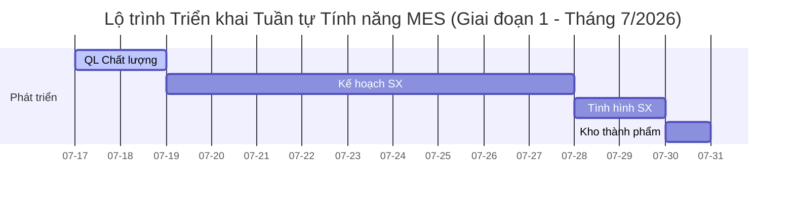

# Phân tích Khả năng Đáp ứng Yêu cầu Quản lý Chất lượng của CSDL MES

Tài liệu này đánh giá khả năng đáp ứng của thiết kế cơ sở dữ liệu MES hiện tại đối với các yêu cầu nghiệp vụ quản lý chất lượng và thống kê sản xuất.

---

## 1. Bản đồ Phân nhóm Tính năng Sản xuất (Giai đoạn Triển khai)

Dưới đây là sơ đồ lộ trình thực hiện các tính năng thuộc nhóm **Có thể làm** (dòng màu xanh) được triển khai tuần tự từ nay (17/7) đến hết tháng 7 năm 2026.

Quy trình ưu tiên triển khai phân hệ **Quản lý chất lượng** đầu tiên (hoàn thành từ 17/7 - 19/7), sau đó thực hiện tuần tự các phân hệ còn lại:

### Bảng Chi tiết Phân loại Lộ trình Tính năng

| Trạng thái | 1. Tình hình sản xuất | 2. Kế hoạch sản xuất | 3. Quản lý chất lượng | 4. Kho thành phẩm | 5. Thiết bị |
| --- | --- | --- | --- | --- | --- |
| **Dự định làm (Nhóm tính năng)** | Sản xuất thực tế | Kế hoạch sản xuất | Quản lý chất lượng | Kho thành phẩm | Thiết bị |
| **Có thể làm (Các dòng màu xanh)** | - Hiện tại nhà máy đang sản xuất những mã hàng nào, sản lượng từng mã hàng là bao nhiêu? | - Thực tế sản xuất: Tổng; Chi tiết (Công đoạn), Chi tiết đến mã hàng - Xuất hàng - PO (Tổng tồn và PO phát trong ngày) - INPUT: Theo dõi thực tế INPUT ngày và tổng thể - Tồn kho - WIP Tồn (Tổng thể, Chi tiết theo công đoạn, Chi tiết theo mã hàng) | - Top 5 hoặc 10 lỗi cao nhất của 1 mã hàng - Top 5 hoặc 10 lỗi của 1 loại hàng - Xu hướng của 1 lỗi nào đó qua các ngày hoặc tuần, tháng (để xác nhận xem tăng giảm hay đột phát) - Thời gian luân chuyển của 1 lot hàng qua các công đoạn (giúp xác nhận xem chậm tại đâu) | - Hiện còn bao nhiêu thành phẩm trong kho? (Tổng thể, theo mã hàng) | *(Không có)* |
| **Triển khai sau (Các dòng còn lại)** | - Sản lượng của từng công đoạn, đạt bao nhiêu % theo kế hoạch - Sản lượng của nhà máy, đạt bao nhiêu % theo kế hoạch - Công đoạn nào đang bị chậm, chậm bao nhiêu so với kế hoạch - Hàng đang bị chậm ở công đoạn nào, Công đoạn nào đang gây nghẽn | *(Tất cả mục đều thuộc nhóm "Có thể làm")* | - Tiến độ của 1 mã hàng so với kế hoạch thì đang như thế nào (nhanh hay chậm) - Lịch sử luân chuyển của 1 lot hàng qua các công đoạn (biết được tách lot ở những công đoạn nào) | - Có đủ thành phẩm để đáp ứng kế hoạch giao hàng không? - Mã hàng nào tồn kho nhiều nhất hoặc tồn kho lâu nhất? - Có bao nhiêu hàng quá hạn hoặc sắp hết hạn sử dụng? - Tình hình nhập kho, xuất kho theo ngày, tuần, tháng. - Có lô hàng nào đang bị Hold hoặc chưa đủ điều kiện xuất kho? | - Những máy có thời gian vận hành thấp nhất (theo tuần tháng năm) - Những máy có chỉ số MTBF thấp nhất (Phản ánh thiết bị hoạt động ko ổn định) - TOP 10 alarm phát sinh nhiều nhất (tra cứu theo ngày, tháng, năm) - Máy sắp hết hạn bảo hành - Các máy có tỉ lệ hàng hỏng cao nhất (theo tuần, tháng, năm) - Tỉ lệ vận hành thiết bị theo công, hoặc theo tảng (theo ngày, tháng năm) |

---

## 2. Yêu cầu đáp ứng ĐẦY ĐỦ (Thống kê & Xu hướng Lỗi)

### 2.1. Top 5 hoặc 10 lỗi cao nhất của 1 mã hàng (`product_id`)

* **Cách đáp ứng:** Lấy thông tin từ sự kiện lỗi phát sinh liên kết với mã hàng của Lot.
* **Bảng và cột sử dụng:**
  * Bảng `lots`: Cột `product_id` (Mã hàng) và `lot_pk` (Khóa ngoại kết nối với lỗi).
  * Bảng `error_events`: Cột `lot_pk` (Liên kết với Lot), `error_id` / `error_catalog_pk` (Mã lỗi), và `quantity` (Số lượng lỗi).
  * Bảng `error_catalog`: Cột `error_name_vi` (Tên tiếng Việt của lỗi) để hiển thị.
  * *Hoặc sử dụng View có sẵn:* `v_error_details` (chứa sẵn thông tin `product_id`, `error_id`, `error_name`, `quantity` và đã được lọc bỏ các bản ghi test/dữ liệu nháp).
* **Prompt mẫu để kiểm thử trên Meibook:**
  * *"Liệt kê 5 loại lỗi có số lượng lớn nhất của mã hàng 3736-0008."*
  * *"Top 5 lỗi xuất hiện nhiều nhất của sản phẩm 3736-0008 là gì, thống kê số lượng từng lỗi?"*
  * *"Cho tôi danh sách 10 lỗi hàng đầu của mã hàng 3736-0008 kèm theo tên lỗi tiếng Việt."*
  * *"製品 3736-0008 の発生数ワースト5のエラー và, その数量を教えてください。"* (Kiểm thử dịch & truy vấn song ngữ tiếng Nhật).

### 2.2. Top 5 hoặc 10 lỗi của 1 loại hàng (`lot_type` hoặc `production_type`)

* **Cách đáp ứng:** Phân loại lỗi theo thuộc tính phân nhóm của Lot.
* **Bảng và cột sử dụng:**
  * Bảng `lots`: Cột `lot_type` (Loại Lot - sản xuất hàng loạt, test, thử nghiệm), `production_type` (Loại sản xuất) và `lot_pk`.
  * Bảng `error_events`: Cột `lot_pk`, `error_id` / `error_catalog_pk` (Mã lỗi), và `quantity` (Số lượng lỗi).
  * Bảng `error_catalog`: Cột `error_name_vi`.
* **Prompt mẫu để kiểm thử trên Meibook:**
  * *"Top 5 lỗi phổ biến nhất đối với các lot có loại sản xuất (production_type) là Mass."*
  * *"Thống kê 5 mã lỗi phát sinh nhiều nhất của các lot thử nghiệm (lot_type = Test)."*
  * *"Đối với loại hàng sản xuất hàng loạt, lỗi nào đang xảy ra nhiều nhất và số lượng là bao nhiêu?"*
  * *"量産ロット（production_type = Mass）で最も発生しているエラー上位5件は何ですか？"* (Kiểm thử dịch & truy vấn song ngữ tiếng Nhật).

### 2.3. Xu hướng của 1 lỗi qua các ngày, tuần, hoặc tháng

* **Cách đáp ứng:** Thống kê số lượng lỗi theo các khoảng thời gian phát sinh được ghi nhận.
* **Bảng và cột sử dụng:**
  * Bảng `error_events`: Cột `error_id` (Mã lỗi), `quantity` (Số lượng lỗi), `error_time` (Thời gian phát sinh lỗi dạng chuỗi `YYYY-MM-DD...`), hoặc `error_time_unix` (Thời gian dạng số nguyên giây để tính toán khoảng thời gian dễ dàng).
  * Bảng `error_catalog`: Kết nối qua `error_catalog_pk` để lọc lỗi theo tên nếu cần.
* **Prompt mẫu để kiểm thử trên Meibook:**
  * *"Thống kê xu hướng số lượng lỗi phát sinh của mã lỗi 0002 theo từng ngày trong tháng 7 năm 2026."*
  * *"Tổng số lượng lỗi 0002 phát sinh theo từng tuần trong tháng vừa qua tăng hay giảm?"*
  * *"Vẽ bảng số lượng lỗi 0002 qua các ngày để tôi xem xu hướng."*
  * *"2026年7月におけるエラーコード 0002 の日別発生推移を教えてください。"* (Kiểm thử dịch & truy vấn song ngữ tiếng Nhật).

---

## 3. Yêu cầu KHÔNG THỂ đáp ứng (Thiếu cấu trúc dữ liệu)

### 3.1. Tiến độ của 1 mã hàng so với kế hoạch (Nhanh hay Chậm)

* **Lý do thiếu:** Database hiện tại chỉ ghi nhận trạng thái tĩnh của các Lot đang chạy hoặc đã chạy (bảng `lots`) chứ **không có bảng lưu Kế hoạch sản xuất** (như số lượng mục tiêu, ngày bắt đầu theo kế hoạch, ngày hoàn thành dự kiến, năng suất yêu cầu...). Không có dữ liệu so sánh mục tiêu thì không thể xác định tiến độ nhanh hay chậm.

### 3.2. Thời gian luân chuyển của 1 lot hàng qua các công đoạn (Chậm tại đâu)

* **Lý do thiếu:** Hệ thống thiếu bảng Log lịch sử di chuyển công đoạn (như `wip_transactions` hoặc `lot_history` lưu vết: *Lot A vào công đoạn 1 lúc mấy giờ, ra lúc mấy giờ, vào công đoạn 2 lúc mấy giờ...*).
  * Bảng `lots` hiện tại chỉ lưu `create_date` (Ngày tạo lot) và `produce_date` (Ngày sản xuất) tổng quát của Lot, cùng với `status` (Trạng thái hiện tại).
  * Bảng `error_events` có ghi nhận công đoạn phát sinh lỗi (`process_id`, `process_order`, `error_time`), nhưng đây chỉ là thời điểm phát sinh lỗi chứ không phải thời điểm Lot đi qua công đoạn đó.

### 3.3. Lịch sử luân chuyển của 1 lot hàng qua các công đoạn (Vết tách lot)

* **Lý do thiếu:** Tương tự như trên, CSDL thiếu bảng Transaction ghi nhận lịch sử di chuyển qua các công đoạn.
  * Mặc dù bảng `lots` có cột `is_release_split_lot` (đánh dấu có phải lot tách không) và bảng `error_events` có cột `lot_id_split` (lot sau khi tách), nhưng chúng không lưu vết lịch sử di chuyển đầy đủ của Lot qua các công đoạn và thời điểm tách cụ thể trong quy trình sản xuất (route/process flow).
