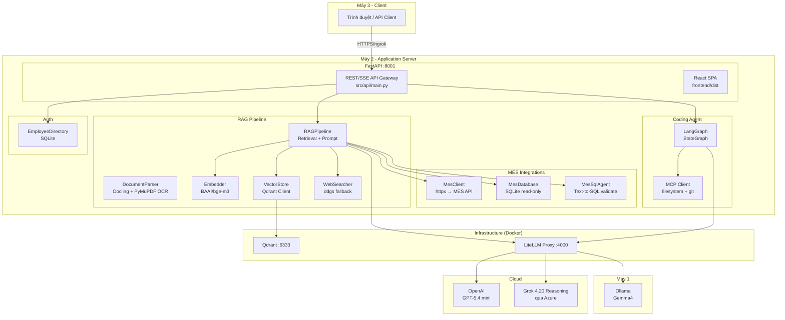
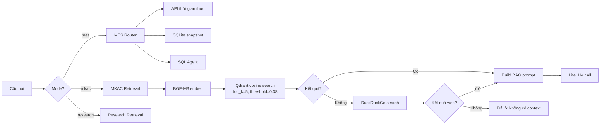

# Phân tích toàn diện Repository Meibook

## 1. Tổng quan hệ thống

**Meibook** là hệ thống hỏi đáp tài liệu nội bộ và Coding Agent cho công ty **MKAC (Meiko Automation)**, triển khai trên mô hình 3 máy:

| Máy | Vai trò |
|---|---|
| **Máy 1** | Ollama chạy Gemma4 local, expose qua ngrok |
| **Máy 2** | Máy chủ ứng dụng chính: FastAPI, React, Qdrant, LiteLLM, BGE-M3, Docling |
| **Máy 3** | Máy khách (trình duyệt) |

Hệ thống cung cấp **3 nhóm chức năng chính** qua giao diện web:
1. **Hỏi đáp hành chính nhân sự MKAC** — tra cứu kho tài liệu nội bộ dùng chung
2. **Quản lý MES** — truy vấn dữ liệu sản xuất (API thời gian thực + snapshot SQLite)
3. **Nghiên cứu tài liệu** — upload và phân tích tài liệu riêng theo phiên
4. **Coding Agent** — endpoint `/agent` cho tác vụ lập trình (bảo vệ bằng API key)

---

## 2. Kiến trúc tổng thể



---

## 3. Cấu trúc thư mục

```text
Meibook/
├── src/
│   ├── api/main.py              # FastAPI Gateway — 790 dòng
│   ├── rag/
│   │   ├── parser.py            # Docling parser + page-aware OCR — 335 dòng
│   │   ├── embedder.py          # BGE-M3 wrapper — 131 dòng
│   │   ├── vector_store.py      # Qdrant operations — 303 dòng
│   │   ├── rag_pipeline.py      # RAG orchestrator — 1394 dòng (lớn nhất)
│   │   └── web_search.py        # DuckDuckGo fallback — 102 dòng
│   ├── auth/
│   │   └── employee_directory.py # SQLite employee lookup — 335 dòng
│   ├── integrations/
│   │   ├── mes_client.py        # MES API client (httpx) — 130 dòng
│   │   ├── mes_database.py      # MES snapshot query service — 493 dòng
│   │   └── mes_sql_agent.py     # Text-to-SQL với SQLGlot validate — 434 dòng
│   └── agent/
│       ├── graph.py             # LangGraph ReAct loop — 119 dòng
│       └── mcp_client.py        # MCP filesystem/git tools — 159 dòng
├── frontend/
│   ├── src/main.jsx             # React SPA (57KB!)
│   ├── src/styles.css           # CSS (40KB)
│   └── vite.config.js
├── config/
│   ├── mkac_manifest.json       # Quản lý tài liệu MKAC
│   └── mes_semantic_model.json  # Schema model cho SQL Agent
├── database/
│   ├── schema/mes.sql           # DDL cho MES SQLite
│   └── raw/                     # Dump gốc (git-ignored)
├── scripts/
│   ├── index_mkac_documents.py  # Index kho tài liệu MKAC
│   ├── import_mes_database.py   # Import MES data vào SQLite
│   ├── import_employee_directory.py # Tạo SQLite danh bạ
│   ├── docker-deploy.sh         # Deploy Docker
│   ├── docker-index-mkac.sh     # Index MKAC trong Docker
│   └── meibook.sh              # Script khởi động chính
├── docker-compose.yml           # Qdrant + LiteLLM (dev/systemd)
├── docker-compose.web.yml       # Full Docker deploy
├── litellm_config.yaml          # Model routing configuration
├── requirements.txt             # 36 dependencies
└── tests/                       # 6 test files
```

---

## 4. Chi tiết các thành phần

### 4.1. API Gateway — [main.py](file:///home/jkl/Code/Meibook/src/api/main.py)

**Trách nhiệm:** Cổng vào duy nhất cho toàn bộ hệ thống.

| Endpoint | Chức năng |
|---|---|
| `GET /health` | Health check + thông tin MKAC, MES, employee |
| `POST /auth/employee` | Xác thực mã nhân viên 6 chữ số |
| `GET /models` | Danh sách model cho frontend |
| `POST /sessions` | Tạo UUID session mới |
| `GET/DELETE /sessions/{id}` | Xem/xóa session |
| `POST /sessions/{id}/upload` | Upload, parse, embed, index tài liệu |
| `DELETE /sessions/{id}/files/{name}` | Xóa file khỏi session |
| `POST /query` | RAG query đồng bộ |
| `POST /query/stream` | RAG query SSE streaming |
| `POST /agent` | Coding Agent (cần `X-Agent-API-Key`) |

**Cơ chế bảo vệ:**
- Rate limit: 15 query/IP/phút, 10 upload/IP/giờ (in-memory)
- Upload admission: 1 concurrent + 4 queue
- UUID validation chống path traversal
- Extension allowlist cho upload
- Upload size limit (mặc định 25 MB)
- PDF page limit (mặc định 100 trang)
- Processing timeout (mặc định 300s)

### 4.2. RAG Pipeline — [rag_pipeline.py](file:///home/jkl/Code/Meibook/src/rag/rag_pipeline.py)

Đây là **file lớn nhất** trong repo (1394 dòng), điều phối toàn bộ logic truy vấn:



**Các system prompt riêng biệt:**
- `MKAC_SYSTEM_PROMPT` — trợ lý nội bộ MKAC
- `RESEARCH_SYSTEM_PROMPT` — chuyên gia nghiên cứu
- `WEB_SYSTEM_PROMPT` — tổng hợp web, không biến thành quy định nội bộ
- `GENERAL_SYSTEM_PROMPT` — chỉ nói "chưa tìm thấy thông tin"
- `MES_SYSTEM_PROMPT` — dữ liệu sản xuất
- `MES_DATABASE_SYSTEM_PROMPT` — MES snapshot

**Logic đặc biệt:**
- Câu hỏi cá nhân (`tôi tên gì`, `bộ phận của tôi`) → dùng employee context, bỏ qua Qdrant
- Câu hỏi tên nhân viên (`Nguyễn Đình Sơn là ai?`) → tra danh bạ SQLite trước
- Câu hỏi bảng/hình → route sang OpenAI Vision
- Relative score filtering (loại tail match yếu < 85% top result)
- Chế độ `research` luôn dùng Grok model

### 4.3. Document Parser — [parser.py](file:///home/jkl/Code/Meibook/src/rag/parser.py)

**Xử lý PDF theo từng trang:**
1. Mở PDF bằng PyMuPDF
2. Mỗi trang: kiểm tra text native (≥80 ký tự thì đủ)
3. Trang scan → render PNG 2x → OCR bằng Docling/EasyOCR
4. Chia chunk ~1400 ký tự, overlap ~220 ký tự
5. Lưu ảnh trang vào `_pages/` directory

**Các format:** `.pdf`, `.docx`, `.xlsx`, `.pptx`, `.html`, `.htm`, `.png`, `.jpg`, `.jpeg`

### 4.4. Embedder — [embedder.py](file:///home/jkl/Code/Meibook/src/rag/embedder.py)

- Model: `BAAI/bge-m3` (1024 dimensions)
- CUDA FP16 mặc định, fallback CPU float32
- Thread lock để serialize GPU inference
- L2 normalization + cosine similarity

### 4.5. Vector Store — [vector_store.py](file:///home/jkl/Code/Meibook/src/rag/vector_store.py)

- 2 collection: `docmind_documents` (research) và `mkac_knowledge` (MKAC)
- Payload index trên `session_id` (keyword) và `source_file`
- Cô lập logic qua `session_id` filter (MKAC dùng `session_id=mkac`)
- UUID point mới mỗi lần index

### 4.6. MES Integration — 3 tầng

#### [mes_client.py](file:///home/jkl/Code/Meibook/src/integrations/mes_client.py) — API thời gian thực
- Gọi MES API qua Bearer token
- Lấy `DEMO_GET_TOTAL_ERROR` để tìm Lot lỗi nhiều nhất
- Giữ tất cả Lot đồng hạng

#### [mes_database.py](file:///home/jkl/Code/Meibook/src/integrations/mes_database.py) — Snapshot cục bộ
- SQLite read-only (`?mode=ro` + `PRAGMA query_only=ON`)
- Allowlist intent cố định: lot details, error breakdown, error name, product summary...
- Chỉ chạy truy vấn tham số hóa — **không nối SQL từ user input**
- Fallback khi API MES lỗi hoặc user yêu cầu snapshot

#### [mes_sql_agent.py](file:///home/jkl/Code/Meibook/src/integrations/mes_sql_agent.py) — Text-to-SQL
- Cho câu hỏi phức hợp (ví dụ: "top 3 loại lỗi trong Lot lỗi nhiều nhất")
- **Bảo vệ nhiều lớp:**
  - LLM chỉ nhìn semantic model (4 view công khai)
  - SQLGlot validate AST: chặn DDL/DML/ATTACH/PRAGMA
  - SQLite authorizer read-only
  - Timeout + LIMIT ép buộc
  - Kết quả validate trước khi trả client

### 4.7. Employee Directory — [employee_directory.py](file:///home/jkl/Code/Meibook/src/auth/employee_directory.py)

- SQLite danh bạ nhân viên (154 người)
- Xác thực mã nhân viên 6 chữ số
- Tra cứu profile: tên, giới tính, chức danh, phòng ban
- Tính thêm: số người cùng phòng, trưởng/phó phòng
- Context cho RAG: tìm tên nhân viên trong câu hỏi, tra danh bạ phòng ban

### 4.8. Coding Agent — [graph.py](file:///home/jkl/Code/Meibook/src/agent/graph.py) + [mcp_client.py](file:///home/jkl/Code/Meibook/src/agent/mcp_client.py)

- LangGraph StateGraph: `agent → tools → agent → ... → END`
- Model: `coding-model` (Gemma4 local, fallback OpenAI)
- Tools: MCP filesystem + git (giới hạn workspace)
- Fallback: 3 tool cục bộ (`read_file`, `write_file`, `list_dir`) nếu MCP không khả dụng
- System prompt tiếng Việt

### 4.9. Web Search — [web_search.py](file:///home/jkl/Code/Meibook/src/rag/web_search.py)

- DuckDuckGo qua thư viện `ddgs` (không cần API key)
- Fallback khi MKAC Qdrant không có kết quả
- Context MKAC được gắn vào query
- Kết quả trả về `answer_scope=web`

---

## 5. Model Routing (LiteLLM)

Cấu hình trong [litellm_config.yaml](file:///home/jkl/Code/Meibook/litellm_config.yaml):

| Model Logic | Backend | Dùng khi |
|---|---|---|
| `auto-model` | GPT-5.4 mini → fallback Grok → Gemma4 | UI chọn `auto` |
| `openai-model` | GPT-5.4 mini | UI chọn `Cloud Model` |
| `local-gemma` | Ollama Gemma4 | UI chọn `Local Model` |
| `grok-model` | Grok 4.20 via Azure | Chế độ `Nghiên cứu` + Vision |
| `coding-model` | Gemma4 → fallback OpenAI | Coding Agent |

**Router:** `simple-shuffle`, retry 1 lần, timeout 120s, global max parallel 8.

---

## 6. Frontend

Single-file React SPA:
- [main.jsx](file:///home/jkl/Code/Meibook/frontend/src/main.jsx) — 57KB (toàn bộ logic trong 1 file)
- [styles.css](file:///home/jkl/Code/Meibook/frontend/src/styles.css) — 40KB

**Tính năng:**
- 3 chế độ: Hành chính nhân sự MKAC / Quản lý MES / Nghiên cứu tài liệu
- Session riêng cho từng chế độ (lưu `localStorage`)
- SSE streaming với Markdown rendering
- Upload/xóa file, dừng streaming, copy response
- Theme: Sáng / Tối / Theo hệ thống (anti-flash script trong `index.html`)
- Panel nguồn progressive disclosure
- Xác thực mã nhân viên cho MKAC

---

## 7. Docker Deployment

### Dev/Systemd — [docker-compose.yml](file:///home/jkl/Code/Meibook/docker-compose.yml)
- Chỉ Qdrant + LiteLLM
- FastAPI chạy riêng bằng uvicorn/systemd

### Docker Web nội bộ — [docker-compose.web.yml](file:///home/jkl/Code/Meibook/docker-compose.web.yml)
- Multi-stage [Dockerfile](file:///home/jkl/Code/Meibook/Dockerfile): Node build frontend → Python app
- 3 service: `app`, `qdrant`, `litellm`
- Qdrant + LiteLLM bind `127.0.0.1` (chỉ nội bộ)
- GPU support (`gpus: all`)
- Named volumes cho HuggingFace cache, EasyOCR cache
- Agent bị tắt (`ENABLE_AGENT=false`)

---

## 8. Testing

6 test files trong [tests/](file:///home/jkl/Code/Meibook/tests):

| File | Mục đích |
|---|---|
| `test_imports.py` | Kiểm tra import module |
| `test_mkac_pipeline.py` | Test RAG MKAC pipeline |
| `test_mes_integration.py` | Test MES API client |
| `test_mes_database.py` | Test MES snapshot queries |
| `test_mes_sql_agent.py` | Test SQL validation/execution |
| `test_import_mes_database.py` | Test import script |

---

## 9. Điểm mạnh của kiến trúc

1. **Tách model vật lý khỏi ứng dụng** — LiteLLM proxy cho phép đổi model không sửa code
2. **Fallback chain tốt** — auto → OpenAI → Grok → Gemma4 local
3. **MES security nhiều lớp** — allowlist intent → parameterized SQL → SQLGlot validate → SQLite authorizer → LIMIT + timeout
4. **OCR page-aware** — giữ số trang thật, lưu ảnh trang để Vision
5. **Employee context injection** — tra danh bạ SQLite trước khi gọi LLM, tránh hallucination
6. **LLM answer validation** — fallback deterministic khi LLM bỏ sót trường bắt buộc

---

## 10. Hạn chế và rủi ro đáng chú ý

> [!WARNING]
> Các hạn chế bảo mật quan trọng khi public hệ thống

| Hạn chế | Chi tiết |
|---|---|
| **Endpoint RAG không xác thực** | Biết UUID = truy cập được session |
| **Rate limit in-memory** | Mất khi restart, không dùng chung giữa workers |
| **CORS cho phép mọi origin** | `allow_origins=["*"]` |
| **Tin X-Forwarded-For** | Client giả header nếu không có trusted proxy |
| **Frontend monolith** | 57KB single JSX file, khó maintain |
| **Session không có TTL** | Dữ liệu chỉ bị xóa khi client gọi hoặc admin dọn |
| **Agent có quyền ghi file** | Rủi ro cao, cần workspace riêng |
| **Upload chỉ check extension** | Chưa kiểm tra MIME/magic bytes |

---

## 11. Dependencies chính

| Nhóm | Thư viện |
|---|---|
| Web | FastAPI, Uvicorn, Pydantic, httpx |
| Document | Docling 2.97, EasyOCR, PyMuPDF |
| Embedding | sentence-transformers, torch, BAAI/bge-m3 |
| Vector DB | qdrant-client 1.9 |
| Agent | LangGraph 1.2.4, LangChain, MCP adapters |
| LLM Proxy | LiteLLM 1.83 |
| SQL Validate | SQLGlot 30.11 |
| Search | ddgs (DuckDuckGo) |
